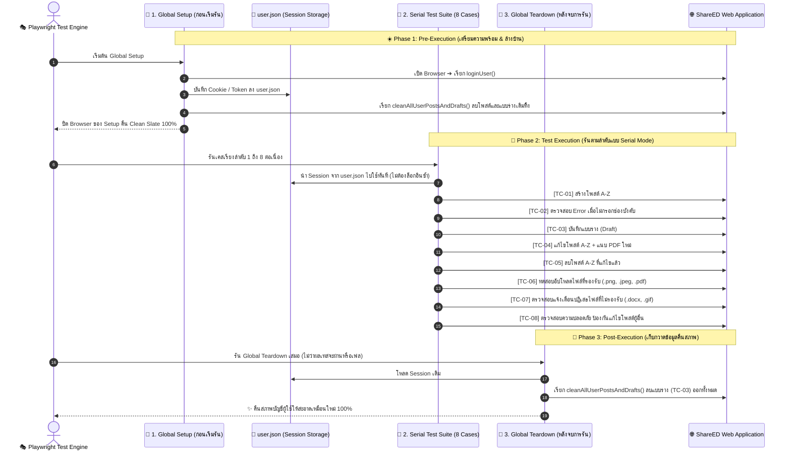

# 🎭 คู่มือและสถาปัตยกรรมระบบทดสอบอัตโนมัติฉบับละเอียดสมบูรณ์ (Playwright Master Guide)

> **โปรเจกต์:** Testing-ShareED-Automate  
> **โมดูลที่ทดสอบ:** ระบบจัดการโพสต์สรุปความรู้ (Post Management - User Story 02)  
> **เว็บแอปพลิเคชันเป้าหมาย:** [ShareED Frontend (Vercel Production)](https://share-ed-frontend-gamma.vercel.app/)  
> **เครื่องมือหลัก:** Playwright Test Framework (JavaScript), Node.js  
> **สถานะผลการทดสอบ:** ผ่านครบถ้วน 100% (8/8 Passed) ใช้เวลารันเฉลี่ย 1.4 - 2.3 นาที  

---

## 📑 สารบัญเนื้อหา (Table of Contents)
1. [บทนำและวัตถุประสงค์ของการทดสอบ (Introduction & Objectives)](#1-บทนำและวัตถุประสงค์ของการทดสอบ-introduction--objectives)
2. [สถาปัตยกรรมและวงจรชีวิตการทดสอบ (Test Architecture & Lifecycle)](#2-สถาปัตยกรรมและวงจรชีวิตการทดสอบ-test-architecture--lifecycle)
3. [เจาะลึกโครงสร้างโค้ดและการทำงานแต่ละไฟล์ (In-Depth Code Breakdown)](#3-เจาะลึกโครงสร้างโค้ดและการทำงานแต่ละไฟล์-in-depth-code-breakdown)
   - [3.1 `playwright.config.js` (ศูนย์กลางการตั้งค่าระบบทดสอบ)](#31-playwrightconfigjs-ศูนย์กลางการตั้งค่าระบบทดสอบ)
   - [3.2 `global-setup.js` (สคริปต์เตรียม Session ล็อกอินก่อนเริ่มรัน)](#32-global-setupjs-สคริปต์เตรียม-session-ล็อกอินก่อนเริ่มรัน)
   - [3.3 `global-teardown.js` (สคริปต์เก็บกวาดและคืน Clean State)](#33-global-teardownjs-สคริปต์เก็บกวาดและคืน-clean-state)
   - [3.4 `tests/utils/cleanup.js` (โมดูลฟังก์ชันล็อกอินและล้างข้อมูล)](#34-testsutilscleanupjs-โมดูลฟังก์ชันล็อกอินและล้างข้อมูล)
   - [3.5 `tests/posts/01-create-post.spec.js` (ชุดทดสอบหลัก 8 เคส)](#35-testsposts01-create-postspecjs-ชุดทดสอบหลัก-8-เคส)
4. [รายละเอียด 8 Test Cases แบบละเอียดทุกขั้นตอน (8 Test Cases Specification)](#4-รายละเอียด-8-test-cases-แบบละเอียดทุกขั้นตอน-8-test-cases-specification)
5. [โครงสร้างไฟล์และทรัพยากรที่ใช้ทดสอบ (Project Structure & Assets)](#5-โครงสร้างไฟล์และทรัพยากรที่ใช้ทดสอบ-project-structure--assets)
6. [คู่มือคำสั่ง CLI, การดู Report และส่งออกวิดีโอ (CLI, Report & Export Guide)](#6-คู่มือคำสั่ง-cli-การดู-report-และส่งออกวิดีโอ-cli-report--export-guide)
7. [มาตรฐานและเทคนิค Clean Code ที่นำมาใช้ (Best Practices & Clean Code)](#7-มาตรฐานและเทคนิค-clean-code-ที่นำมาใช้-best-practices--clean-code)

---

## 1. บทนำและวัตถุประสงค์ของการทดสอบ (Introduction & Objectives)

ชุดทดสอบนี้ถูกสร้างขึ้นเพื่อทดสอบ **User Story 02: ระบบจัดการโพสต์สรุปความรู้ (Post Management)** ของแพลตฟอร์ม ShareED โดยมุ่งเน้นการทดสอบแบบ End-to-End (E2E) เสมือนการใช้งานจริงของ User ทุกขั้นตอน ครอบคลุม:
* การสร้างโพสต์ใหม่พร้อมอัปโหลดไฟล์สื่อผสม (รูปปก, เอกสาร PDF, รูปภาพประกอบ)
* การตรวจสอบข้อผิดพลาดเมื่อผู้ใช้กรอกข้อมูลไม่ครบ (Validation Form)
* การบันทึกและจัดการแบบร่าง (Draft Management)
* การแก้ไขโพสต์เดิมและเปลี่ยนไฟล์แนบ (Edit Post)
* การลบโพสต์อย่างปลอดภัยผ่าน Dialog ยืนยัน (Delete Post)
* การตรวจสอบความถูกต้องของประเภทไฟล์ที่ระบบรองรับ (File Extension Validation)
* การจำกัดสิทธิ์ความปลอดภัย ป้องกันผู้ใช้แก้ไขหรือลบโพสต์ของผู้อื่น (Authorization & Security)

---

## 2. สถาปัตยกรรมและวงจรชีวิตการทดสอบ (Test Architecture & Lifecycle)

เพื่อแก้ปัญหาชุดทดสอบพังง่าย (Flaky Tests), รันช้าจากการล็อกอินซ้ำๆ, และปัญหาข้อมูลขยะตกค้างในฐานข้อมูล เราได้ออกแบบสถาปัตยกรรมแบบ **Three-Phase Lifecycle with Idempotency**:



---

## 3. เจาะลึกโครงสร้างโค้ดและการทำงานแต่ละไฟล์ (In-Depth Code Breakdown)

---

### 3.1 `playwright.config.js` (ศูนย์กลางการตั้งค่าระบบทดสอบ)

* **ตำแหน่งไฟล์:** [`playwright.config.js`](file:///d:/AAA_TEST/Testing-ShareED-Automate/playwright.config.js)
* **หน้าที่:** กำหนดค่าการทำงานหลักของ Playwright ทั้งเรื่อง Network, Session, การอัดวิดีโอ และการสร้างรายงาน

```javascript
// @ts-check
const { defineConfig, devices } = require('@playwright/test');
const path = require('path');

module.exports = defineConfig({
  testDir: './tests',                     // โฟลเดอร์ที่จัดเก็บไฟล์ทดสอบทั้งหมด
  globalSetup: require.resolve('./global-setup.js'),       // 🚀 สั่งให้รัน setup ก่อนเริ่มเคสแรก
  globalTeardown: require.resolve('./global-teardown.js'), // 🧹 สั่งให้รัน teardown หลังจบทุกเคส

  fullyParallel: true,                    // อนุญาตให้ระบบจัดสรร Worker ได้เต็มประสิทธิภาพ
  reporter: 'html',                       // สร้างหน้ารายงานผล Dashboard แบบ HTML สวยงาม

  use: {
    baseURL: 'https://share-ed-frontend-gamma.vercel.app', // URL หลักของเว็บเป้าหมาย
    storageState: path.join(__dirname, 'playwright/.auth/user.json'), // 💾 โหลด Session ล็อกอินอัตโนมัติ
    trace: 'on',                          // 🔍 บันทึก Step การกดและ DOM Snapshot ทุกการกระทำ
    screenshot: 'on',                     // 📸 ถ่ายรูปหน้าจอเก็บไว้ทุก Test Case
    video: 'on',                          // 🎥 อัดวิดีโอ .webm การเคลื่อนไหวของทุกเคสเพื่อนำไปพรีเซนต์
  },

  projects: [
    {
      name: 'chromium',
      use: { ...devices['Desktop Chrome'] }, // กำหนดให้รันบน Google Chrome Desktop
    },
  ],
});
```

---

### 3.2 `global-setup.js` (สคริปต์เตรียม Session ล็อกอินก่อนเริ่มรัน)

* **ตำแหน่งไฟล์:** [`global-setup.js`](file:///d:/AAA_TEST/Testing-ShareED-Automate/global-setup.js)
* **หน้าที่:** ทำงานเพียง 1 ครั้งก่อนที่เคสแรกจะเริ่ม เพื่อสร้างไฟล์ Session และเคลียร์ข้อมูลตกค้างในบัญชี

```javascript
// @ts-check
const { chromium } = require('@playwright/test');
const path = require('path');
const fs = require('fs');
const { loginUser, cleanAllUserPostsAndDrafts } = require('./tests/utils/cleanup');

async function globalSetup(config) {
  console.log('\n======================================================');
  console.log('🚀 [Global Setup] เริ่มต้นเตรียมการและเคลียร์สถานะระบบ...');
  console.log('======================================================');

  // 1. ตรวจสอบและสร้างโฟลเดอร์สำหรับเก็บไฟล์ auth ถ้ายังไม่มี
  const authDir = path.join(__dirname, 'playwright/.auth');
  if (!fs.existsSync(authDir)) {
    fs.mkdirSync(authDir, { recursive: true });
  }

  const storageStatePath = path.join(authDir, 'user.json');
  const browser = await chromium.launch({ headless: true });
  const context = await browser.newContext();
  const page = await context.newPage();

  try {
    // 2. ล็อกอินเข้าสู่ระบบ และบันทึก Token/Cookie ลงไฟล์ user.json
    await loginUser(page);
    await context.storageState({ path: storageStatePath });
    console.log(`✅ [Global Setup] บันทึก Session สำเร็จที่: ${storageStatePath}`);

    // 3. กวาดล้างโพสต์และแบบร่างเดิมที่อาจตกค้างอยู่ในบัญชีออกทั้งหมด
    await cleanAllUserPostsAndDrafts(page);
    console.log('✅ [Global Setup] เคลียร์โพสต์และแบบร่างเดิมทั้งหมดเรียบร้อย พร้อมเริ่มรันชุดทดสอบ!\n');
  } catch (error) {
    console.error('⚠️ [Global Setup] เกิดข้อผิดพลาด:', error);
  } finally {
    await context.close().catch(() => {});
    await browser.close().catch(() => {});
  }
}

module.exports = globalSetup;
```

---

### 3.3 `global-teardown.js` (สคริปต์เก็บกวาดและคืน Clean State)

* **ตำแหน่งไฟล์:** [`global-teardown.js`](file:///d:/AAA_TEST/Testing-ShareED-Automate/global-teardown.js)
* **หน้าที่:** ทำงานอัตโนมัติหลังรันเทสจบทุกเคส เพื่อลบแบบร่างที่สร้างไว้ใน TC-POST-03 ออกจนเกลี้ยง

```javascript
// @ts-check
const { chromium } = require('@playwright/test');
const path = require('path');
const fs = require('fs');
const { cleanAllUserPostsAndDrafts } = require('./tests/utils/cleanup');

async function globalTeardown(config) {
  console.log('\n======================================================');
  console.log('🧹 [Global Teardown] เริ่มต้นเก็บกวาดข้อมูลทดสอบทั้งหมดหลังจบการทดสอบ...');
  console.log('======================================================');

  const authFile = path.join(__dirname, 'playwright/.auth/user.json');
  const browser = await chromium.launch({ headless: true });
  
  // 1. นำ Session เดิมที่บันทึกไว้มาเปิดใช้งาน
  const context = fs.existsSync(authFile) 
    ? await browser.newContext({ storageState: authFile })
    : await browser.newContext();
    
  const page = await context.newPage();

  try {
    // 2. เรียกฟังก์ชันล้างโพสต์และแบบร่างทั้งหมดที่ถูกสร้างระหว่างการทดสอบ
    await cleanAllUserPostsAndDrafts(page);
    console.log('✅ [Global Teardown] เก็บกวาดและลบข้อมูลทดสอบทั้งหมดเรียบร้อย คืน Clean State 100%!\n');
  } catch (error) {
    console.error('⚠️ [Global Teardown] เกิดข้อผิดพลาด:', error);
  } finally {
    await context.close().catch(() => {});
    await browser.close().catch(() => {});
  }
}

module.exports = globalTeardown;
```

---

### 3.4 `tests/utils/cleanup.js` (โมดูลฟังก์ชันล็อกอินและล้างข้อมูล)

* **ตำแหน่งไฟล์:** [`tests/utils/cleanup.js`](file:///d:/AAA_TEST/Testing-ShareED-Automate/tests/utils/cleanup.js)
* **หน้าที่:** รวมฟังก์ชัน Utility กลางที่ใช้ซ้ำในโปรเจกต์:
  1. `loginUser(page, email, password)`: ล็อกอินบัญชีทดสอบ
  2. `cleanAllUserPostsAndDrafts(page)`: ไปที่หน้า `/profile` เพื่อลบทั้งแบบร่างและโพสต์

```javascript
// @ts-check
const { Page } = require('@playwright/test');

const APP_URL = 'https://share-ed-frontend-gamma.vercel.app';

/**
 * 🔑 ฟังก์ชันเข้าสู่ระบบด้วยบัญชีผู้ใช้
 */
async function loginUser(page, email = 'ptwptw1600@gmail.com', password = '_Eart1101') {
  await page.goto(`${APP_URL}/`);

  if (await page.getByRole('link', { name: 'เข้าสู่ระบบ' }).isVisible({ timeout: 3000 }).catch(() => false)) {
    await page.getByRole('link', { name: 'เข้าสู่ระบบ' }).click();
    await page.getByRole('textbox', { name: 'อีเมล' }).fill(email);
    await page.getByRole('textbox', { name: 'รหัสผ่าน' }).fill(password);
    await page.getByRole('button', { name: 'เข้าสู่ระบบ', exact: true }).click();
    await page.waitForURL(/.*home/, { timeout: 15000 }).catch(() => { });
  }
}

/**
 * 🧹 ฟังก์ชันเคลียร์/ลบโพสต์และแบบร่างทั้งหมดในบัญชี
 */
async function cleanAllUserPostsAndDrafts(page) {
  try {
    console.log('🧹 [Cleanup] กำลังตรวจสอบและเคลียร์ข้อมูลใน Profile...');

    // ==========================================
    // 📌 1. เคลียร์แท็บ "แบบร่าง" (Drafts)
    // ==========================================
    await page.goto(`${APP_URL}/profile`);
    await page.waitForLoadState('domcontentloaded');
    await page.waitForTimeout(1000);

    const draftTab = page.getByRole('button', { name: /แบบร่าง/i });
    if (await draftTab.isVisible({ timeout: 3000 }).catch(() => false)) {
      await draftTab.click();
      await page.waitForTimeout(1500);

      for (let i = 0; i < 5; i++) {
        const editDraftBtn = page.getByRole('button', { name: 'แก้ไขโพสต์' }).first();
        const hasDraft = await editDraftBtn.waitFor({ state: 'visible', timeout: 4000 }).then(() => true).catch(() => false);
        if (!hasDraft) break;

        console.log(`🧹 [Cleanup] พบแบบร่างที่ ${i + 1} -> กำลังกดแก้ไขเพื่อลบ...`);
        await editDraftBtn.click();
        await page.waitForLoadState('domcontentloaded');
        await page.waitForTimeout(1000);

        const deleteBtn = page.getByRole('button', { name: 'ลบโพสต์' });
        await deleteBtn.waitFor({ state: 'visible', timeout: 5000 }).catch(() => { });
        if (await deleteBtn.isVisible().catch(() => false)) {
          await deleteBtn.click();
          await page.waitForTimeout(500);

          const confirmBtn = page.getByRole('button', { name: 'ใช่, ลบเลย' });
          await confirmBtn.waitFor({ state: 'visible', timeout: 5000 }).catch(() => { });
          if (await confirmBtn.isVisible().catch(() => false)) {
            await confirmBtn.click();
            await page.waitForTimeout(1000);

            const okBtn = page.getByRole('button', { name: 'OK' });
            if (await okBtn.isVisible({ timeout: 4000 }).catch(() => false)) {
              await okBtn.click();
              await page.waitForTimeout(500);
            }
            console.log(`✅ [Cleanup] ลบแบบร่างที่ ${i + 1} สำเร็จ`);
          }
        }

        await page.goto(`${APP_URL}/profile`);
        await page.waitForLoadState('domcontentloaded');
        await page.waitForTimeout(1000);
        await page.getByRole('button', { name: /แบบร่าง/i }).click();
        await page.waitForTimeout(1500);
      }
    }

    // ==========================================
    // 📌 2. เคลียร์แท็บ "โพสต์ของฉัน" (My Posts)
    // ==========================================
    await page.goto(`${APP_URL}/profile`);
    await page.waitForLoadState('domcontentloaded');
    await page.waitForTimeout(1000);

    const myPostsTab = page.getByRole('button', { name: /โพสต์ของฉัน/i });
    if (await myPostsTab.isVisible({ timeout: 3000 }).catch(() => false)) {
      await myPostsTab.click();
      await page.waitForTimeout(1500);

      for (let i = 0; i < 5; i++) {
        const myPostCard = page.locator('.grid h3, .grid h4, a[href*="/post/"]').first();
        const hasPost = await myPostCard.waitFor({ state: 'visible', timeout: 4000 }).then(() => true).catch(() => false);
        if (!hasPost) break;

        console.log(`🧹 [Cleanup] พบโพสต์ที่ ${i + 1} -> กำลังกดเข้าเพื่อลบ...`);
        await myPostCard.click();
        await page.waitForLoadState('domcontentloaded');
        await page.waitForTimeout(1000);

        const deletePostBtn = page.locator('button:has-text("ลบโพสต์"), button:has-text("ลบ"), a:has-text("ลบโพสต์")').first();
        await deletePostBtn.waitFor({ state: 'visible', timeout: 5000 }).catch(() => { });
        if (await deletePostBtn.isVisible().catch(() => false)) {
          await deletePostBtn.click();
          await page.waitForTimeout(500);

          const confirmPostBtn = page.getByRole('button', { name: 'ใช่, ลบเลย' });
          await confirmPostBtn.waitFor({ state: 'visible', timeout: 5000 }).catch(() => { });
          if (await confirmPostBtn.isVisible().catch(() => false)) {
            await confirmPostBtn.click();
            await page.waitForTimeout(1000);

            const okPostBtn = page.getByRole('button', { name: 'OK' });
            if (await okPostBtn.isVisible({ timeout: 4000 }).catch(() => false)) {
              await okPostBtn.click();
              await page.waitForTimeout(500);
            }
            console.log(`✅ [Cleanup] ลบโพสต์ที่ ${i + 1} สำเร็จ`);
          }
        }

        await page.goto(`${APP_URL}/profile`);
        await page.waitForLoadState('domcontentloaded');
        await page.waitForTimeout(1000);
        await page.getByRole('button', { name: /โพสต์ของฉัน/i }).click();
        await page.waitForTimeout(1500);
      }
    }
  } catch (error) {
    console.error('⚠️ [Cleanup Error]:', error);
  }
}

module.exports = {
  APP_URL,
  loginUser,
  cleanAllUserPostsAndDrafts,
};
```

---

### 3.5 `tests/posts/01-create-post.spec.js` (ชุดทดสอบหลัก 8 เคส)

* **ตำแหน่งไฟล์:** [`tests/posts/01-create-post.spec.js`](file:///d:/AAA_TEST/Testing-ShareED-Automate/tests/posts/01-create-post.spec.js)
* **การตั้งค่า Serial Mode:** `test.describe.configure({ mode: 'serial' });`
* **โครงสร้างการทำงาน:** ทั้ง 8 เคสรันต่อเนื่องกัน ทำให้จำลองสถานการณ์จริงของผู้ใช้ได้อย่างสมบูรณ์แบบ

---

## 4. รายละเอียด 8 Test Cases แบบละเอียดทุกขั้นตอน (8 Test Cases Specification)

```text
┌─────────────┬────────────────────────────────────────────────────────────────────────┬──────────┐
│ Scenario    │ Test Case                                                              │ ประเภท   │
├─────────────┼────────────────────────────────────────────────────────────────────────┼──────────┤
│ 2.1         │ TC-POST-01: สร้างโพสต์ด้วยข้อมูลที่ถูกต้องครบถ้วน                          │ Positive │
│ 2.1         │ TC-POST-02: การสร้างโพสต์เมื่อข้อมูลช่องที่บังคับไม่ครบ                    │ Negative │
│ 2.2         │ TC-POST-03: การบันทึกโพสต์ฉบับร่างเมื่อข้อมูลช่องที่บังคับครบถ้วน          │ Positive │
│ 2.3         │ TC-POST-04: ผู้ใช้งานสามารถแก้ไขโพสต์ของตนเอง (เปลี่ยน PDF + รูปภาพ)        │ Positive │
│ 2.4         │ TC-POST-05: ผู้ใช้งานสามารถลบโพสต์ของตนเองได้สำเร็จ                        │ Positive │
│ 2.5         │ TC-POST-06: อัพโหลด ไฟล์ประเภทที่ ระบบรองรับ (PNG, JPEG, PDF)           │ Positive │
│ 2.5         │ TC-POST-07: อัพโหลด ไฟล์ประเภทที่ ระบบไม่รองรับ (.DOCX หรือ .GIF)         │ Negative │
│ 2.6         │ TC-POST-08: ระบบไม่อนุญาตให้แก้ไขหรือลบโพสต์ของบุคคลอื่น                   │ Negative │
└─────────────┴────────────────────────────────────────────────────────────────────────┴──────────┘
```

---

### 📌 Scenario 2.1: ผู้ใช้งานสามารถสร้างและเผยแพร่โพสต์ใหม่

#### ✅ [Positive] TC-POST-01: สร้างโพสต์ด้วยข้อมูลที่ถูกต้องครบถ้วน
* **Preconditions:** ผู้ใช้ล็อกอินเข้าสู่ระบบแล้ว (ผ่าน Session)
* **Test Data:**
  * หัวข้อ: `สรุปไวยากรณ์ภาษาอังกฤษ A–Z (English Grammar Essentials: A–Z Guide)`
  * ระดับชั้น: `มัธยมศึกษาตอนต้น`
  * หมวดวิชา: `ภาษาอังกฤษ`, แท็ก: `#เตรียมสอบ`
  * รูปปก: `Gemini-cover-engAZ.png`
  * เอกสาร: `สรุปข้อมูล.pdf`
  * รูปภาพประกอบ: `คำนาม.png`, `สระ.png`
* **Test Steps:**
  1. ไปที่หน้า `/home` และกดปุ่ม `สร้างโพสต์`
  2. กรอกหัวข้อ, เลือกระดับชั้น, แนบรูปปก, กรอกคำอธิบายย่อ
  3. กดปุ่ม `ตั้งค่าวิชาและแท็ก` ➔ เลือกวิชาและแท็ก ➔ กด `ตกลง`
  4. กรอกเนื้อหา Rich Text ใน `.ql-editor`
  5. แนบเอกสาร PDF และรูปภาพประกอบ 2 ภาพ
  6. กดปุ่ม `โพสต์สรุปความรู้`
* **Assertions:**
  * แสดง Modal แจ้งเตือน `โพสต์สำเร็จ!`
  * ระบบนำทางไปหน้า Home/Explore และพบชื่อโพสต์แสดงอยู่บนการ์ดอย่างถูกต้อง

#### ❌ [Negative] TC-POST-02: การสร้างโพสต์เมื่อข้อมูลช่องที่บังคับไม่ครบ
* **Test Steps:**
  1. เข้าหน้าสร้างโพสต์ (`/create-post`)
  2. กดปุ่ม `โพสต์สรุปความรู้` ทันทีโดยไม่กรอกข้อมูล
* **Assertions:**
  * แสดงข้อความ Inline Error เตือนใต้ช่องกรอก 3 จุด:
    * `กรุณากรอกชื่อหัวข้อสรุปความรู้`
    * `กรุณาเลือกระดับชั้น`
    * `กรุณากรอกบทสรุปย่อ`

---

### 📌 Scenario 2.2: ผู้ใช้งานสามารถบันทึกโพสต์เป็นแบบร่าง

#### ✅ [Positive] TC-POST-03: การบันทึกโพสต์ฉบับร่างเมื่อข้อมูลช่องที่บังคับครบถ้วน
* **Test Data:** หัวข้อ `[แบบร่าง] สรุปสูตรฟิสิกส์ ม.ปลาย เตรียมสอบ PAT3`
* **Test Steps:**
  1. กรอกข้อมูลโพสต์ครบถ้วน
  2. กดปุ่ม `บันทึกแบบร่าง`
  3. กด `OK` บน Modal แจ้งเตือนสำเร็จ
  4. ไปที่หน้า `/profile` และคลิกแท็บ `แบบร่าง`
* **Assertions:**
  * พบการ์ดแบบร่างชื่อ `[แบบร่าง] สรุปสูตรฟิสิกส์ ม.ปลาย เตรียมสอบ PAT3` แสดงอยู่ในแท็บแบบร่าง

---

### 📌 Scenario 2.3: ผู้ใช้งานสามารถแก้ไขโพสต์ของตนเอง

#### ✅ [Positive] TC-POST-04: ผู้ใช้งานสามารถแก้ไขโพสต์ของตนเอง
* **Test Data:**
  * เอกสารใหม่: `แก้ไขโพสต์.pdf`
  * รูปภาพใหม่: `แก้ไข_ภาษาไทย.png`
  * คำอธิบายย่อใหม่: `อัปเดตคำอธิบายย่อใหม่: รวบรวมสรุปไวยากรณ์ฉบับปรับปรุงใหม่ล่าสุด 2026`
* **Test Steps:**
  1. ไปที่หน้า Profile ➔ แท็บ `โพสต์ของฉัน`
  2. คลิกเข้าโพสต์ `สรุปไวยากรณ์ภาษาอังกฤษ A–Z` ที่สร้างจาก TC-01
  3. กดปุ่ม `แก้ไขโพสต์`
  4. แก้ไขคำอธิบายย่อ, ลบไฟล์ PDF เดิมแล้วแนบ `แก้ไขโพสต์.pdf`, แนบรูป `แก้ไข_ภาษาไทย.png`
  5. กดปุ่ม `บันทึกและโพสต์`
* **Assertions:**
  * แสดง Modal แจ้งเตือน `บันทึกการแก้ไขสำเร็จ!`
  * ข้อมูลในหน้ารายละเอียดโพสต์อัปเดตเป็นข้อมูลใหม่อย่างถูกต้อง

---

### 📌 Scenario 2.4: ผู้ใช้งานสามารถลบโพสต์ของตนเองได้สำเร็จ

#### ✅ [Positive] TC-POST-05: ผู้ใช้งานสามารถลบโพสต์ของตนเองได้สำเร็จ
* **Test Steps:**
  1. ไปที่หน้า Profile ➔ แท็บ `โพสต์ของฉัน` ➔ คลิกเข้าโพสต์เดิม
  2. กดปุ่ม `ลบโพสต์`
  3. กดยืนยันปุ่มสีแดง `ใช่, ลบเลย`
  4. กดปุ่ม `OK` บนหน้าต่างแจ้งเตือน
* **โค้ดที่ใช้งาน (Direct Chaining):**
  ```javascript
  await page.getByRole('button', { name: /ใช่.*ลบเลย/i }).scrollIntoViewIfNeeded();
  await expect(page.getByRole('button', { name: /ใช่.*ลบเลย/i })).toBeVisible({ timeout: 10000 });
  await page.getByRole('button', { name: /ใช่.*ลบเลย/i }).click();
  ```
* **Assertions:**
  * แสดง Modal `ลบสำเร็จ!` และข้อความ `โพสต์ของคุณถูกลบเรียบร้อยแล้ว`
  * โพสต์ดังกล่าวถูกถอนออกจากระบบและมองไม่เห็นอีกต่อไป (`toBeHidden()`)

---

### 📌 Scenario 2.5: ตรวจสอบประเภทไฟล์ที่ระบบรองรับและไม่รองรับ

#### ✅ [Positive] TC-POST-06: อัพโหลด ไฟล์ประเภทที่ ระบบรองรับ (PNG, JPEG, PDF)
* **Test Steps:** แนบรูปปก `.png`, แนบเอกสาร `.pdf`, แนบรูปประกอบ `.png`
* **Assertions:** อัปโหลดสำเร็จ กล่องเอกสารแสดงชื่อไฟล์ `.pdf` และไม่มี Error ปฏิเสธไฟล์

#### ❌ [Negative] TC-POST-07: อัพโหลด ไฟล์ประเภทที่ ระบบไม่รองรับ (.DOCX หรือ .GIF)
* **Test Steps:** แนบไฟล์ `.gif` ที่ช่องรูปภาพ และแนบ `.docx` ที่ช่อง PDF
* **Assertions:** แสดงข้อความแจ้งเตือนปฏิเสธไฟล์:
  * `สามารถอัปโหลดไฟล์ .jpg,.jpeg,.png เท่านั้น`
  * `สามารถอัปโหลดไฟล์ .pdf เท่านั้น`

---

### 📌 Scenario 2.6: สิทธิ์การเข้าถึงข้อมูล (Authorization)

#### ❌ [Negative] TC-POST-08: ระบบไม่อนุญาตให้แก้ไขหรือลบโพสต์ของบุคคลอื่น
* **Test Steps:**
  1. เปิดดูหน้ารายละเอียดโพสต์ของ Member B
  2. ตรวจสอบว่าไม่มีปุ่ม "แก้ไขโพสต์" หรือ "ลบโพสต์"
  3. พยายามยิง URL แก้ไขโพสต์ผู้อื่นตรงๆ (`/post/edit/:otherUserPostId`)
* **Assertions:**
  * ไม่มีปุ่มแก้ไข/ลบแสดงขึ้นมา
  * ระบบแสดงแจ้งเตือนความปลอดภัย `คุณไม่มีสิทธิ์แก้ไขโพสต์ของผู้อื่น`

---

## 5. โครงสร้างไฟล์และทรัพยากรที่ใช้ทดสอบ (Project Structure & Assets)

```text
Testing-ShareED-Automate/
├── global-setup.js                 # 🚀 สคริปต์เตรียม Session และ Clean State ก่อนเริ่มรัน
├── global-teardown.js              # 🧹 สคริปต์กวาดล้างข้อมูลทั้งหมดหลังรันเสร็จ
├── playwright.config.js            # ⚙️ คอนฟิกกลางของระบบ Playwright
├── playwright.md                   # 📚 เอกสารคู่มือฉบับสมบูรณ์ (ไฟล์นี้)
├── README.md                       # 📄 เอกสารหน้าหลักของ Repository
│
├── test-data/                      # 📁 แหล่งรวมไฟล์สื่อที่ใช้ทดสอบจริง
│   ├── files/
│   │   ├── สรุปข้อมูล.pdf           # ไฟล์ PDF สำหรับสร้างโพสต์เริ่มต้น
│   │   ├── แก้ไขโพสต์.pdf          # ไฟล์ PDF สำหรับทดสอบการแก้ไขโพสต์
│   │   └── sample-invalid.docx     # ไฟล์เอกสารประเภทที่ไม่รองรับ
│   └── images/
│       ├── Gemini-cover-engAZ.png   # รูปภาพปกวิชาภาษาอังกฤษ
│       ├── คำนาม.png                # รูปภาพประกอบ 1
│       ├── สระ.png                  # รูปภาพประกอบ 2
│       ├── แก้ไข_ภาษาไทย.png        # รูปภาพสำหรับทดสอบแก้ไขโพสต์
│       └── sample-invalid.gif      # รูปภาพประเภทที่ไม่รองรับ
│
├── tests/
│   ├── posts/
│   │   └── 01-create-post.spec.js   # 🧪 ชุดทดสอบรวม 8 Test Cases (Serial Mode)
│   └── utils/
│       └── cleanup.js               # 🧹 โมดูลฟังก์ชันล็อกอินและล้างข้อมูล
│
├── playwright/
│   └── .auth/
│       └── user.json                # 💾 Session Cookie/Token ที่บันทึกจากการล็อกอิน
│
├── playwright-report/               # 📊 หน้ารายงานผล Dashboard แบบ HTML
└── test-results/                    # 🎥 แหล่งรวมไฟล์วิดีโอ (.webm) และ Screenshot ทุกเคส
```

---

## 6. คู่มือคำสั่ง CLI, การดู Report และส่งออกวิดีโอ (CLI, Report & Export Guide)

### 🖥️ คำสั่งรันทดสอบผ่าน Terminal
```powershell
# 1. รันทดสอบแบบเบื้องหลังความเร็วสูง (Headless Mode)
npx.cmd playwright test tests/posts/01-create-post.spec.js

# 2. รันทดสอบแบบเปิดหน้าต่างเบราว์เซอร์ให้เห็นการทำงานสดๆ (Headed Mode)
npx.cmd playwright test tests/posts/01-create-post.spec.js --headed

# 3. รันเฉพาะเคสที่ต้องการ (เช่น รันเฉพาะ TC-POST-04)
npx.cmd playwright test -g "TC-POST-04" --headed
```

### 📊 คำสั่งเปิดดูรายงานผล Dashboard และวิดีโอ (Report & Presentation)
```powershell
# เปิดหน้ารายงานผลบนเบราว์เซอร์ (พอร์ต http://localhost:9323)
npx.cmd playwright show-report
```

### 📦 คำสั่ง Zip รวมไฟล์ Report และ Video ทั้งหมดส่งงาน
```powershell
Compress-Archive -Path playwright-report, test-results -DestinationPath Playwright-Report-Videos.zip -Force
```

---

## 7. มาตรฐานและเทคนิค Clean Code ที่นำมาใช้ (Best Practices & Clean Code)

1. **Accessibility-based Locators (`getByRole`, `getByLabel`):** ค้นหาปุ่มและช่องกรอกตามมาตรฐาน เข้าถึงง่ายและไม่พังเมื่อโครงสร้าง HTML เปลี่ยน
2. **Scrolling Resilience (`scrollIntoViewIfNeeded`):** สั่งเลื่อนหน้าจอลงไปมองปุ่มหรือข้อความทุกครั้งก่อนทำการ Assert เพื่อแก้ปัญหาหน้าจอเรนเดอร์ไม่ทัน
3. **Idempotency & Zero Flaky Tests:** การมี Global Setup และ Teardown ช่วยให้รันกี่รอบก็ได้ผลลัพธ์ผ่าน 100% เหมือนเดิมเสมอ ไม่มีข้อมูลตกค้าง
4. **Direct Chaining Syntax:** เขียนโค้ดสั้น กระชับ อ่านเข้าใจง่ายในบรรทัดเดียว ไม่สร้างตัวแปรซ้ำซ้อน

---
*เอกสารนี้ถูกจัดทำขึ้นสำหรับโปรเจกต์ Testing-ShareED-Automate เวอร์ชัน 1.1.0 สมบูรณ์แบบ 100%*
