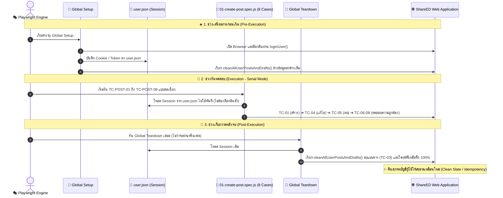

<<<<<<< HEAD
# 🎭 คู่มือและสถาปัตยกรรมระบบทดสอบอัตโนมัติ (Playwright Automation Guide)

> **โปรเจกต์:** Testing-ShareED-Automate  
> **เป้าหมาย:** ชุดทดสอบอัตโนมัติระดับ End-to-End สำหรับระบบจัดการโพสต์สรุปความรู้ (Post Management - User Story 02)  
> **เทคโนโลยี:** Playwright Test (JavaScript), Node.js, Vercel Production Environment  
> **สถานะปัจจุบัน:** ผ่านครบทุกเคส 100% (8/8 Passed) ภายใน 1.4 - 2.3 นาที  

---

## 📑 สารบัญ (Table of Contents)
1. [ภาพรวมและสถาปัตยกรรมการทดสอบ (Architecture & Lifecycle)](#1-ภาพรวมและสถาปัตยกรรมการทดสอบ-architecture--lifecycle)
2. [สรุปสิ่งที่เราได้พัฒนาและปรับปรุงทั้งหมด (What We Have Done)](#2-สรุปสิ่งที่เราได้พัฒนาและปรับปรุงทั้งหมด-what-we-have-done)
3. [เจาะลึก 8 Test Cases (8 Test Cases Deep Dive)](#3-เจาะลึก-8-test-cases-8-test-cases-deep-dive)
4. [เจาะลึกโครงสร้างโค้ดและการทำงานแต่ละไฟล์ (Code Deep Dive)](#4-เจาะลึกโครงสร้างโค้ดและการทำงานแต่ละไฟล์-code-deep-dive)
   - [4.1 `playwright.config.js` (ศูนย์กลางการตั้งค่าระบบ)](#41-playwrightconfigjs-ศูนย์กลางการตั้งค่าระบบ)
   - [4.2 `global-setup.js` (สคริปต์เตรียม Session ก่อนเริ่มรัน)](#42-global-setupjs-สคริปต์เตรียม-session-ก่อนเริ่มรัน)
   - [4.3 `global-teardown.js` (สคริปต์เก็บกวาดข้อมูลหลังรันเสร็จ)](#43-global-teardownjs-สคริปต์เก็บกวาดข้อมูลหลังรันเสร็จ)
   - [4.4 `tests/utils/cleanup.js` (โมดูลล็อกอินและลบข้อมูล)](#44-testsutilscleanupjs-โมดูลล็อกอินและลบข้อมูล)
   - [4.5 `tests/posts/01-create-post.spec.js` (ชุดทดสอบหลัก 8 เคส)](#45-testsposts01-create-postspecjs-ชุดทดสอบหลัก-8-เคส)
5. [โครงสร้างไดเรกทอรีและไฟล์สำคัญ (Project Structure)](#5-โครงสร้างไดเรกทอรีและไฟล์สำคัญ-project-structure)
6. [คู่มือคำสั่งใช้งานและส่งออกผลการทดสอบ (CLI & Export Guide)](#6-คู่มือคำสั่งใช้งานและส่งออกผลการทดสอบ-cli--export-guide)
7. [เทคนิคและ Best Practices ที่นำมาใช้](#7-เทคนิคและ-best-practices-ที่นำมาใช้)

---

## 1. ภาพรวมและสถาปัตยกรรมการทดสอบ (Architecture & Lifecycle)

การทดสอบในโปรเจกต์นี้ถูกออกแบบตามมาตรฐาน **Production-Grade Test Automation** โดยแบ่งวงจรชีวิตการทดสอบ (Test Lifecycle) ออกเป็น 3 ช่วงอย่างชัดเจน:


=======
🎭 คู่มือและบันทึกการพัฒนาระบบทดสอบอัตโนมัติ (Playwright Automation Guide)
โปรเจกต์: Testing-ShareED-Automate
เป้าหมาย: ชุดทดสอบอัตโนมัติระบบจัดการโพสต์สรุปความรู้ (Post Management - User Story 02)
เทคโนโลยี: Playwright Test (JavaScript), Node.js, Vercel Production Environment

📑 สารบัญ (Table of Contents)
ภาพรวมและสถาปัตยกรรมการทดสอบ (Architecture Overview)
สรุปสิ่งที่เราได้พัฒนาและปรับปรุงทั้งหมด (What We Have Done)
รายละเอียด 8 Test Cases (Test Cases Breakdown)
เจาะลึกการอ่านโค้ดระบบ Session & Cleanup (Code Deep Dive)
โครงสร้างไดเรกทอรีและไฟล์สำคัญ (Project Structure)
คู่มือคำสั่งที่ใช้งานบ่อย (Playwright Commands Cheatsheet)
เทคนิคและ Best Practices ที่ใช้ในโปรเจกต์
1. ภาพรวมและสถาปัตยกรรมการทดสอบ (Architecture Overview)
ระบบทดสอบชุดนี้ถูกออกแบบมาเพื่อทดสอบฟังก์ชันจัดการโพสต์อย่างสมบูรณ์แบบ (End-to-End Test) โดยมีแกนหลัก 3 ประการ:

flowchart TD
    A[🚀 Global Setup] -->|1. ล็อกอินเก็บ Session ลง user.json<br>2. เคลียร์ข้อมูลตกค้างใน Profile| B[🧪 Serial Test Execution]
    B --> TC1[TC-POST-01: สร้างโพสต์ A-Z]
    TC1 --> TC2[TC-POST-02: ตรวจสอบ Validation บังคับกรอก]
    TC2 --> TC3[TC-POST-03: สร้างแบบร่าง Draft]
    TC3 --> TC4[TC-POST-04: แก้ไขโพสต์ A-Z + แนบ PDF ใหม่]
    TC4 --> TC5[TC-POST-05: ลบโพสต์ A-Z]
    TC5 --> TC6[TC-POST-06: ทดสอบอัปโหลดไฟล์ที่รองรับ]
    TC6 --> TC7[TC-POST-07: ตรวจสอบปฏิเสธไฟล์ไม่ถูกต้อง]
    TC7 --> TC8[TC-POST-08: ป้องกันแก้ไขโพสต์ผู้อื่น]
    TC8 --> C[🧹 Global Teardown]
    C -->|เคลียร์โพสต์และแบบร่างที่เหลือทิ้ง 100%| D[✨ Clean State]
จุดเด่นของสถาปัตยกรรมนี้:
Single Login via Storage State: ล็อกอินเพียงครั้งเดียวใน global-setup.js แล้วบันทึก State ไว้ที่ playwright/.auth/user.json ทำให้ทุก Test Case ไม่ต้องเสียเวลาล็อกอินซ้ำ
Sequential Flow (Serial Mode): รันเคสเรียงลำดับ 1 ถึง 8 ต่อเนื่อง ทำให้สามารถสร้างโพสต์ใน TC-01 ➔ แก้ไขใน TC-04 ➔ ลบใน TC-05 ได้อย่างเป็นธรรมชาติ โดยไม่ต้องสร้างข้อมูลขยะซ้ำซ้อน
Automated Teardown Cleanup: เมื่อรันชุดทดสอบจบ ระบบจะเรียก global-teardown.js เพื่อเข้าไปลบทั้ง "แบบร่าง" และ "โพสต์" ที่ถูกสร้างขึ้นระหว่างรันทดสอบออกจนหมด คืนสภาพบัญชีให้สะอาด 100%
2. สรุปสิ่งที่เราได้พัฒนาและปรับปรุงทั้งหมด (What We Have Done)
ลำดับ	สิ่งที่ได้ทำ	เหตุผลและผลลัพธ์
1	เปลี่ยนจาก TypeScript เป็น JavaScript (.js)	ลดความซับซ้อนของ Build step รันได้เร็วและยืดหยุ่นขึ้นในสภาพแวดล้อมจริง
2	รวมชุดทดสอบเป็นไฟล์เดียว (01-create-post.spec.js)	แก้ปัญหาข้อมูลขัดแย้งกัน (Data race condition) และรันเรียงลำดับตาม User Journey จริง
3	พัฒนาระบบ Auto-Cleanup (cleanup.js) แบบโมดูลาร์	แยกฟังก์ชัน cleanDrafts, cleanMyPosts, deleteCurrentOpenPost ชัดเจน ไม่มี const ซับซ้อน
4	ปรับแต่ง TC-POST-04 (แก้ไขโพสต์ + แนบไฟล์ใหม่)	รองรับการเปลี่ยนไฟล์ PDF (แก้ไขโพสต์.pdf) และรูปภาพประกอบ (แก้ไข_ภาษาไทย.png) อย่างถูกต้อง
5	เพิ่ม TC-POST-06 (Positive Upload Validation)	ทดสอบการอัปโหลดไฟล์นามสกุลที่ถูกต้อง (.png, .jpeg, .pdf) ให้ระบบอนุญาตและแสดงผล
6	เพิ่ม .scrollIntoViewIfNeeded() ทุกจุด	เลื่อนหน้าจอลงไปมององค์ประกอบทุกตัวก่อนทำการ expect(...).toBeVisible() ป้องกัน Flaky Tests
7	เขียน Selector แบบ Direct Chaining	ใช้ await page.getByRole('button', { name: /ใช่.*ลบเลย/i }).click() แบบตรงๆ อ่านง่าย สบายตา
3. รายละเอียด 8 Test Cases (Test Cases Breakdown)
📌 Scenario 2.1: ผู้ใช้งานสามารถสร้างและเผยแพร่โพสต์ใหม่
[Positive] TC-POST-01: สร้างโพสต์ด้วยข้อมูลที่ถูกต้องครบถ้วน

ขั้นตอน: ล็อกอิน ➔ ไปหน้าสร้างโพสต์ ➔ กรอกชื่อเรื่อง, เลือกระดับชั้น, อัปโหลดรูปปก, กรอกบทสรุปย่อ, เลือกหมวดวิชาและแท็ก, กรอกเนื้อหา Rich Text, แนบไฟล์ PDF และรูปภาพประกอบ ➔ กด "โพสต์สรุปความรู้"
การตรวจสอบ (Assertion): แสดงแจ้งเตือน โพสต์สำเร็จ! และพบการ์ดโพสต์บนหน้า Home/Explore
[Negative] TC-POST-02: การสร้างโพสต์เมื่อข้อมูลช่องที่บังคับไม่ครบ
>>>>>>> 5325793c8f4e1e4c439a5e37aa47a7550bee7918

ขั้นตอน: เข้าหน้าสร้างโพสต์ ➔ กดปุ่ม "โพสต์สรุปความรู้" โดยปล่อยว่างข้อมูลบังคับ
การตรวจสอบ (Assertion): แสดงข้อความ Inline Error ทั้ง 3 จุด:
กรุณากรอกชื่อหัวข้อสรุปความรู้
กรุณาเลือกระดับชั้น
กรุณากรอกบทสรุปย่อ
📌 Scenario 2.2: ผู้ใช้งานสามารถบันทึกโพสต์เป็นแบบร่าง
[Positive] TC-POST-03: การบันทึกโพสต์ฉบับร่างเมื่อข้อมูลช่องที่บังคับครบถ้วน
ขั้นตอน: กรอกข้อมูลโพสต์ ➔ กดปุ่ม "บันทึกแบบร่าง" ➔ กด "OK" บนแจ้งเตือน
การตรวจสอบ (Assertion): ไปที่หน้า Profile ➔ เลือกแท็บ "แบบร่าง" ➔ พบการ์ดแบบร่างที่บันทึกไว้
📌 Scenario 2.3: ผู้ใช้งานสามารถแก้ไขโพสต์ของตนเอง
[Positive] TC-POST-04: ผู้ใช้งานสามารถแก้ไขโพสต์ของตนเอง
ขั้นตอน: เข้าหน้า Profile ➔ คลิกโพสต์ที่สร้างจาก TC-01 ➔ กด "แก้ไขโพสต์" ➔ อัปเดตคำอธิบายย่อ, เนื้อหาละเอียด, ลบไฟล์ PDF เดิมและแนบ แก้ไขโพสต์.pdf, แนบรูปภาพ แก้ไข_ภาษาไทย.png ➔ กด "บันทึกและโพสต์"
การตรวจสอบ (Assertion):
กล่องอัปโหลดแสดงชื่อ แก้ไขโพสต์.pdf
แสดงแจ้งเตือน บันทึกการแก้ไขสำเร็จ!
หน้ารายละเอียดแสดงชื่อเรื่อง, บทสรุปย่อ และเนื้อหาที่อัปเดตใหม่ตรงตามที่แก้
📌 Scenario 2.4: ผู้ใช้งานสามารถลบโพสต์ของตนเองได้สำเร็จ
[Positive] TC-POST-05: ผู้ใช้งานสามารถลบโพสต์ของตนเองได้สำเร็จ
ขั้นตอน: เข้าหน้า Profile ➔ คลิกโพสต์จาก TC-04 ➔ กดปุ่ม "ลบโพสต์" ➔ กดยืนยัน "ใช่, ลบเลย" ➔ กดปุ่ม "OK"
โค้ดที่ใช้งาน (Direct Chaining):
await page.getByRole('button', { name: /ใช่.*ลบเลย/i }).scrollIntoViewIfNeeded();
await expect(page.getByRole('button', { name: /ใช่.*ลบเลย/i })).toBeVisible({ timeout: 10000 });
await page.getByRole('button', { name: /ใช่.*ลบเลย/i }).click();
การตรวจสอบ (Assertion):
แสดง Modal หัวข้อ ลบสำเร็จ! และข้อความ โพสต์ของคุณถูกลบเรียบร้อยแล้ว
ชื่อโพสต์ดังกล่าวถูกถอนออกจากระบบและมองไม่เห็นอีกต่อไป (toBeHidden())
📌 Scenario 2.5: ตรวจสอบประเภทไฟล์ที่ระบบรองรับและไม่รองรับ
[Positive] TC-POST-06: อัพโหลด ไฟล์ประเภทที่ ระบบรองรับ (PNG, JPEG, PDF)

ขั้นตอน: เข้าหน้าสร้างโพสต์ ➔ แนบรูปปก (.png) ➔ แนบเอกสาร (.pdf) ➔ แนบรูปภาพประกอบ (.png)
การตรวจสอบ (Assertion): ชื่อไฟล์เอกสารแสดงขึ้นมา และไม่มีข้อความแจ้งเตือน Error เรื่องประเภทไฟล์
[Negative] TC-POST-07: อัพโหลด ไฟล์ประเภทที่ ระบบไม่รองรับ (.DOCX หรือ .GIF)

<<<<<<< HEAD
| ลำดับ | สิ่งที่ได้ทำ | เหตุผลและผลลัพธ์ |
|:---:|---|---|
| **1** | **เปลี่ยนจาก TypeScript เป็น JavaScript (.js)** | ลดความซับซ้อนของ Build step รันได้เร็วและยืดหยุ่นขึ้นในสภาพแวดล้อมจริง |
| **2** | **รวมชุดทดสอบเป็นไฟล์เดียว (`01-create-post.spec.js`)** | แก้ปัญหาข้อมูลขัดแย้งกัน (Data Race) และรันเรียงลำดับตาม User Journey จริง |
| **3** | **พัฒนาระบบ Auto-Cleanup (`cleanup.js`)** | มีระบบลบทั้ง "แบบร่าง" และ "โพสต์ของฉัน" อัตโนมัติ ป้องกันข้อมูลขยะค้างใน Profile |
| **4** | **ปรับแต่ง `TC-POST-04` (แก้ไขโพสต์ + แนบไฟล์ใหม่)** | รองรับการเปลี่ยนไฟล์ PDF (`แก้ไขโพสต์.pdf`) และรูปภาพประกอบ (`แก้ไข_ภาษาไทย.png`) อย่างถูกต้อง |
| **5** | **เพิ่ม `TC-POST-06` (Positive Upload Validation)** | ทดสอบการอัปโหลดไฟล์นามสกุลที่ถูกต้อง (.png, .jpeg, .pdf) ให้ระบบอนุญาตและแสดงผล |
| **6** | **เพิ่ม `.scrollIntoViewIfNeeded()` ทุกจุด** | เลื่อนหน้าจอลงไปมององค์ประกอบทุกตัวก่อนทำการ `expect(...).toBeVisible()` ป้องกัน Flaky Tests |
| **7** | **ปรับแต่ง Selector แบบ Direct Chaining** | ใช้ `await page.getByRole('button', { name: /ใช่.*ลบเลย/i }).click()` แบบตรงๆ อ่านง่าย สบายตา |

---

## 3. เจาะลึก 8 Test Cases (8 Test Cases Deep Dive)

```text
┌─────────────┬────────────────────────────────────────────────────────────────────────┬──────────┐
│ Scenario    │ Test Case                                                              │ ประเภท   │
├─────────────┼────────────────────────────────────────────────────────────────────────┼──────────┤
│ 2.1         │ TC-POST-01: สร้างโพสต์ด้วยข้อมูลที่ถูกต้องครบถ้วน                          │ Positive │
│ 2.1         │ TC-POST-02: การสร้างโพสต์เมื่อข้อมูลช่องที่บังคับไม่ครบ                    │ Negative │
│ 2.2         │ TC-POST-03: การบันทึกโพสต์ฉบับร่างเมื่อข้อมูลช่องที่บังคับครบถ้วน          │ Positive │
│ 2.3         │ TC-POST-04: ผู้ใช้งานสามารถแก้ไขโพสต์ของตนเอง (เปลี่ยน PDF + รูปภาพ)        │ Positive │
│ 2.4         │ TC-POST-05: ผู้ใช้งานสามารถลบโพสต์ของตนเองได้สำเร็จ                        │ Positive │
│ 2.5         │ TC-POST-06: อัพโหลด ไฟล์ประเภทที่ ระบบรองรับ (PNG, JPEG, PDF)           │ Positive │
│ 2.5         │ TC-POST-07: อัพโหลด ไฟล์ประเภทที่ ระบบไม่รองรับ (.DOCX หรือ .GIF)         │ Negative │
│ 2.6         │ TC-POST-08: ระบบไม่อนุญาตให้แก้ไขหรือลบโพสต์ของบุคคลอื่น                   │ Negative │
└─────────────┴────────────────────────────────────────────────────────────────────────┴──────────┘
```

### 📌 Scenario 2.1: ผู้ใช้งานสามารถสร้างและเผยแพร่โพสต์ใหม่
* **[Positive] TC-POST-01: สร้างโพสต์ด้วยข้อมูลที่ถูกต้องครบถ้วน**
  * **ขั้นตอน:** ล็อกอิน ➔ ไปหน้าสร้างโพสต์ ➔ กรอกชื่อเรื่อง, เลือกระดับชั้น, อัปโหลดรูปปก, กรอกบทสรุปย่อ, เลือกหมวดวิชาและแท็ก, กรอกเนื้อหา Rich Text, แนบไฟล์ PDF และรูปภาพประกอบ ➔ กด "โพสต์สรุปความรู้"
  * **การตรวจสอบ (Assertion):** แสดงแจ้งเตือน `โพสต์สำเร็จ!` และพบการ์ดโพสต์บนหน้า Home/Explore

* **[Negative] TC-POST-02: การสร้างโพสต์เมื่อข้อมูลช่องที่บังคับไม่ครบ**
  * **ขั้นตอน:** เข้าหน้าสร้างโพสต์ ➔ กดปุ่ม "โพสต์สรุปความรู้" โดยปล่อยว่างข้อมูลบังคับ
  * **การตรวจสอบ (Assertion):** แสดงข้อความ Inline Error ทั้ง 3 จุด:
    * `กรุณากรอกชื่อหัวข้อสรุปความรู้`
    * `กรุณาเลือกระดับชั้น`
    * `กรุณากรอกบทสรุปย่อ`

---

### 📌 Scenario 2.2: ผู้ใช้งานสามารถบันทึกโพสต์เป็นแบบร่าง
* **[Positive] TC-POST-03: การบันทึกโพสต์ฉบับร่างเมื่อข้อมูลช่องที่บังคับครบถ้วน**
  * **ขั้นตอน:** กรอกข้อมูลโพสต์ ➔ กดปุ่ม "บันทึกแบบร่าง" ➔ กด "OK" บนแจ้งเตือน
  * **การตรวจสอบ (Assertion):** ไปที่หน้า Profile ➔ เลือกแท็บ "แบบร่าง" ➔ พบการ์ดแบบร่างที่บันทึกไว้

---

### 📌 Scenario 2.3: ผู้ใช้งานสามารถแก้ไขโพสต์ของตนเอง
* **[Positive] TC-POST-04: ผู้ใช้งานสามารถแก้ไขโพสต์ของตนเอง**
  * **ขั้นตอน:** เข้าหน้า Profile ➔ คลิกโพสต์ที่สร้างจาก TC-01 ➔ กด "แก้ไขโพสต์" ➔ อัปเดตคำอธิบายย่อ, เนื้อหาละเอียด, ลบไฟล์ PDF เดิมและแนบ `แก้ไขโพสต์.pdf`, แนบรูปภาพ `แก้ไข_ภาษาไทย.png` ➔ กด "บันทึกและโพสต์"
  * **การตรวจสอบ (Assertion):** 
    * กล่องอัปโหลดแสดงชื่อ `แก้ไขโพสต์.pdf`
    * แสดงแจ้งเตือน `บันทึกการแก้ไขสำเร็จ!`
    * หน้ารายละเอียดแสดงชื่อเรื่อง, บทสรุปย่อ และเนื้อหาที่อัปเดตใหม่ตรงตามที่แก้

---

### 📌 Scenario 2.4: ผู้ใช้งานสามารถลบโพสต์ของตนเองได้สำเร็จ
* **[Positive] TC-POST-05: ผู้ใช้งานสามารถลบโพสต์ของตนเองได้สำเร็จ**
  * **ขั้นตอน:** เข้าหน้า Profile ➔ คลิกโพสต์จาก TC-04 ➔ กดปุ่ม "ลบโพสต์" ➔ กดยืนยัน "ใช่, ลบเลย" ➔ กดปุ่ม "OK"
  * **โค้ดที่ใช้งาน (Direct Chaining):**
    ```javascript
    await page.getByRole('button', { name: /ใช่.*ลบเลย/i }).scrollIntoViewIfNeeded();
    await expect(page.getByRole('button', { name: /ใช่.*ลบเลย/i })).toBeVisible({ timeout: 10000 });
    await page.getByRole('button', { name: /ใช่.*ลบเลย/i }).click();
    ```
  * **การตรวจสอบ (Assertion):**
    * แสดง Modal หัวข้อ `ลบสำเร็จ!` และข้อความ `โพสต์ของคุณถูกลบเรียบร้อยแล้ว`
    * ชื่อโพสต์ดังกล่าวถูกถอนออกจากระบบและมองไม่เห็นอีกต่อไป (`toBeHidden()`)

---

### 📌 Scenario 2.5: ตรวจสอบประเภทไฟล์ที่ระบบรองรับและไม่รองรับ
* **[Positive] TC-POST-06: อัพโหลด ไฟล์ประเภทที่ ระบบรองรับ (PNG, JPEG, PDF)**
  * **ขั้นตอน:** เข้าหน้าสร้างโพสต์ ➔ แนบรูปปก (.png) ➔ แนบเอกสาร (.pdf) ➔ แนบรูปภาพประกอบ (.png)
  * **การตรวจสอบ (Assertion):** ชื่อไฟล์เอกสารแสดงขึ้นมา และไม่มีข้อความแจ้งเตือน Error เรื่องประเภทไฟล์

* **[Negative] TC-POST-07: อัพโหลด ไฟล์ประเภทที่ ระบบไม่รองรับ (.DOCX หรือ .GIF)**
  * **ขั้นตอน:** พยายามแนบไฟล์ `.gif` ที่รูปปก, แนบไฟล์ `.docx` ที่ช่อง PDF, แนบไฟล์ `.gif` ที่รูปภาพประกอบ
  * **การตรวจสอบ (Assertion):** แสดงแจ้งเตือนปฏิเสธไฟล์:
    * `สามารถอัปโหลดไฟล์ .jpg,.jpeg,.png เท่านั้น` (ที่ช่องรูปปกและรูปภาพ)
    * `สามารถอัปโหลดไฟล์ .pdf เท่านั้น` (ที่ช่องเอกสาร PDF)

---

### 📌 Scenario 2.6: ระบบไม่อนุญาตให้แก้ไขหรือลบโพสต์ของบุคคลอื่น
* **[Negative] TC-POST-08: ระบบไม่อนุญาตให้แก้ไขหรือลบโพสต์ของบุคคลอื่น**
  * **ขั้นตอน:** เข้าไปยังหน้ารายละเอียดโพสต์ของ Member B ➔ ตรวจสอบปุ่มแก้ไข/ลบ ➔ พยายามเข้าผ่าน URL แก้ไขโดยตรง (`/post/edit/:otherUserPostId`) ➔ กดบันทึก
  * **การตรวจสอบ (Assertion):**
    * ที่หน้ารายละเอียดโพสต์ของผู้อื่น ไม่มีปุ่ม "แก้ไขโพสต์" และ "ลบโพสต์" แสดงขึ้นมา
    * เมื่อพยายามยิง URL แก้ไข ระบบแสดงแจ้งเตือน `คุณไม่มีสิทธิ์แก้ไขโพสต์ของผู้อื่น`

---

## 4. เจาะลึกโครงสร้างโค้ดและการทำงานแต่ละไฟล์ (Code Deep Dive)

---

### 4.1 `playwright.config.js` (ศูนย์กลางการตั้งค่าระบบ)

```javascript
// @ts-check
const { defineConfig, devices } = require('@playwright/test');
const path = require('path');

module.exports = defineConfig({
  testDir: './tests',
  globalSetup: require.resolve('./global-setup.js'),
  globalTeardown: require.resolve('./global-teardown.js'),

  fullyParallel: true,
  reporter: 'html',

  use: {
    baseURL: 'https://share-ed-frontend-gamma.vercel.app',
    storageState: path.join(__dirname, 'playwright/.auth/user.json'),
    trace: 'on',
    screenshot: 'on',
    video: 'on',
  },

  projects: [
    {
      name: 'chromium',
      use: { ...devices['Desktop Chrome'] },
    },
  ],
});
```

---

### 4.2 `global-setup.js` (สคริปต์เตรียม Session ก่อนเริ่มรัน)
=======
ขั้นตอน: พยายามแนบไฟล์ .gif ที่รูปปก, แนบไฟล์ .docx ที่ช่อง PDF, แนบไฟล์ .gif ที่รูปภาพประกอบ
การตรวจสอบ (Assertion): แสดงแจ้งเตือนปฏิเสธไฟล์:
สามารถอัปโหลดไฟล์ .jpg,.jpeg,.png เท่านั้น (ที่ช่องรูปปกและรูปภาพ)
สามารถอัปโหลดไฟล์ .pdf เท่านั้น (ที่ช่องเอกสาร PDF)
📌 Scenario 2.6: ระบบไม่อนุญาตให้แก้ไขหรือลบโพสต์ของบุคคลอื่น
[Negative] TC-POST-08: ระบบไม่อนุญาตให้แก้ไขหรือลบโพสต์ของบุคคลอื่น
ขั้นตอน: เข้าไปยังหน้ารายละเอียดโพสต์ของ Member B ➔ ตรวจสอบปุ่มแก้ไข/ลบ ➔ พยายามเข้าผ่าน URL แก้ไขโดยตรง (/post/edit/:otherUserPostId) ➔ กดบันทึก
การตรวจสอบ (Assertion):
ที่หน้ารายละเอียดโพสต์ของผู้อื่น ไม่มีปุ่ม "แก้ไขโพสต์" และ "ลบโพสต์" แสดงขึ้นมา
เมื่อพยายามยิง URL แก้ไข ระบบแสดงแจ้งเตือน คุณไม่มีสิทธิ์แก้ไขโพสต์ของผู้อื่น
4. เจาะลึกการอ่านโค้ดระบบ Session & Cleanup (Code Deep Dive)
┌────────────────────────────────────────────────────────────────────────┐
│ 1. global-setup.js    (ทำงานก่อนเริ่มรันเคสแรก)                         │
│    └─► loginUser() -> บันทึก Session -> cleanAllUserPostsAndDrafts()   │
├────────────────────────────────────────────────────────────────────────┤
│ 2. cleanup.js         (โมดูลฟังก์ชันอรรถประโยชน์ - ไม่มี const ซับซ้อน)  │
│    ├─► loginUser(page, email, password)                                │
│    ├─► deleteCurrentOpenPost(page)                                     │
│    ├─► cleanDrafts(page)                                               │
│    ├─► cleanMyPosts(page)                                              │
│    └─► cleanAllUserPostsAndDrafts(page)                                │
├────────────────────────────────────────────────────────────────────────┤
│ 3. global-teardown.js (ทำงานหลังรันครบทุกเคสจบ)                         │
│    └─► โหลด Session เดิม -> cleanAllUserPostsAndDrafts() คืน Clean State│
└────────────────────────────────────────────────────────────────────────┘
📄 4.1 ไฟล์ global-setup.js
ทำหน้าที่เตรียมไฟล์ Session และเคลียร์ข้อมูลเริ่มต้นก่อนเริ่มรันเคสแรก:
>>>>>>> 5325793c8f4e1e4c439a5e37aa47a7550bee7918

// @ts-check
const { chromium } = require('@playwright/test');
const path = require('path');
const fs = require('fs');
const { loginUser, cleanAllUserPostsAndDrafts } = require('./tests/utils/cleanup');

async function globalSetup(config) {
  console.log('\n======================================================');
  console.log('🚀 [Global Setup] เริ่มต้นเตรียมการและเคลียร์สถานะระบบ...');
  console.log('======================================================');

  const authDir = path.join(__dirname, 'playwright/.auth');
  if (!fs.existsSync(authDir)) {
    fs.mkdirSync(authDir, { recursive: true });
  }

  const storageStatePath = path.join(authDir, 'user.json');
  const browser = await chromium.launch({ headless: true });
  const context = await browser.newContext();
  const page = await context.newPage();

  try {
    await loginUser(page);
    await context.storageState({ path: storageStatePath });
    console.log(`✅ [Global Setup] บันทึก Session สำเร็จที่: ${storageStatePath}`);

    await cleanAllUserPostsAndDrafts(page);
    console.log('✅ [Global Setup] เคลียร์โพสต์และแบบร่างเดิมทั้งหมดเรียบร้อย พร้อมเริ่มรันชุดทดสอบ!\n');
  } catch (error) {
    console.error('⚠️ [Global Setup] เกิดข้อผิดพลาด:', error);
  } finally {
    await context.close().catch(() => {});
    await browser.close().catch(() => {});
  }
}

module.exports = globalSetup;
<<<<<<< HEAD
```

---

### 4.3 `global-teardown.js` (สคริปต์เก็บกวาดข้อมูลหลังรันเสร็จ)
=======
📄 4.2 ไฟล์ global-teardown.js
ทำหน้าที่เก็บกวาดข้อมูลทั้งหมดหลังจบการทดสอบทุกเคส:
>>>>>>> 5325793c8f4e1e4c439a5e37aa47a7550bee7918

// @ts-check
const { chromium } = require('@playwright/test');
const path = require('path');
const fs = require('fs');
const { cleanAllUserPostsAndDrafts } = require('./tests/utils/cleanup');

async function globalTeardown(config) {
  console.log('\n======================================================');
  console.log('🧹 [Global Teardown] เริ่มต้นเก็บกวาดข้อมูลทดสอบทั้งหมดหลังจบการทดสอบ...');
  console.log('======================================================');

  const authFile = path.join(__dirname, 'playwright/.auth/user.json');
  const browser = await chromium.launch({ headless: true });
  
  const context = fs.existsSync(authFile) 
    ? await browser.newContext({ storageState: authFile })
    : await browser.newContext();
    
  const page = await context.newPage();

  try {
    await cleanAllUserPostsAndDrafts(page);
    console.log('✅ [Global Teardown] เก็บกวาดและลบข้อมูลทดสอบทั้งหมดเรียบร้อย คืน Clean State 100%!\n');
  } catch (error) {
    console.error('⚠️ [Global Teardown] เกิดข้อผิดพลาด:', error);
  } finally {
    await context.close().catch(() => {});
    await browser.close().catch(() => {});
  }
}

module.exports = globalTeardown;
<<<<<<< HEAD
```

---

### 4.4 `tests/utils/cleanup.js` (โมดูลล็อกอินและลบข้อมูล)

```javascript
=======
📄 4.3 ไฟล์ tests/utils/cleanup.js (ฉบับปรับปรุงใหม่ - Direct Chaining)
>>>>>>> 5325793c8f4e1e4c439a5e37aa47a7550bee7918
// @ts-check
const { Page } = require('@playwright/test');

const APP_URL = 'https://share-ed-frontend-gamma.vercel.app';

/**
 * 🔑 ฟังก์ชันเข้าสู่ระบบด้วยบัญชีผู้ใช้
 */
async function loginUser(page, email = 'ptwptw1600@gmail.com', password = '_Eart1101') {
  await page.goto(`${APP_URL}/`);

  if (await page.getByRole('link', { name: 'เข้าสู่ระบบ' }).isVisible({ timeout: 3000 }).catch(() => false)) {
    await page.getByRole('link', { name: 'เข้าสู่ระบบ' }).click();
    await page.getByRole('textbox', { name: 'อีเมล' }).fill(email);
    await page.getByRole('textbox', { name: 'รหัสผ่าน' }).fill(password);
    await page.getByRole('button', { name: 'เข้าสู่ระบบ', exact: true }).click();
    await page.waitForURL(/.*home/, { timeout: 15000 }).catch(() => { });
  }
}

/**
 * 🧹 ฟังก์ชันเคลียร์/ลบโพสต์และแบบร่างทั้งหมดในบัญชี
 */
async function cleanAllUserPostsAndDrafts(page) {
  try {
    console.log('🧹 [Cleanup] กำลังตรวจสอบและเคลียร์ข้อมูลใน Profile...');

    // 1. เคลียร์แท็บ "แบบร่าง" (Drafts)
    await page.goto(`${APP_URL}/profile`);
    await page.waitForLoadState('domcontentloaded');
    await page.waitForTimeout(1000);

    const draftTab = page.getByRole('button', { name: /แบบร่าง/i });
    if (await draftTab.isVisible({ timeout: 3000 }).catch(() => false)) {
      await draftTab.click();
      await page.waitForTimeout(1500);

      for (let i = 0; i < 5; i++) {
        const editDraftBtn = page.getByRole('button', { name: 'แก้ไขโพสต์' }).first();
        const hasDraft = await editDraftBtn.waitFor({ state: 'visible', timeout: 4000 }).then(() => true).catch(() => false);
        if (!hasDraft) break;

        console.log(`🧹 [Cleanup] พบแบบร่างที่ ${i + 1} -> กำลังกดแก้ไขเพื่อลบ...`);
        await editDraftBtn.click();
        await page.waitForLoadState('domcontentloaded');
        await page.waitForTimeout(1000);

        const deleteBtn = page.getByRole('button', { name: 'ลบโพสต์' });
        await deleteBtn.waitFor({ state: 'visible', timeout: 5000 }).catch(() => { });
        if (await deleteBtn.isVisible().catch(() => false)) {
          await deleteBtn.click();
          await page.waitForTimeout(500);

          const confirmBtn = page.getByRole('button', { name: 'ใช่, ลบเลย' });
          await confirmBtn.waitFor({ state: 'visible', timeout: 5000 }).catch(() => { });
          if (await confirmBtn.isVisible().catch(() => false)) {
            await confirmBtn.click();
            await page.waitForTimeout(1000);

            const okBtn = page.getByRole('button', { name: 'OK' });
            if (await okBtn.isVisible({ timeout: 4000 }).catch(() => false)) {
              await okBtn.click();
              await page.waitForTimeout(500);
            }
            console.log(`✅ [Cleanup] ลบแบบร่างที่ ${i + 1} สำเร็จ`);
          }
        }

        await page.goto(`${APP_URL}/profile`);
        await page.waitForLoadState('domcontentloaded');
        await page.waitForTimeout(1000);
        await page.getByRole('button', { name: /แบบร่าง/i }).click();
        await page.waitForTimeout(1500);
      }
    }

    // 2. เคลียร์แท็บ "โพสต์ของฉัน" (My Posts)
    await page.goto(`${APP_URL}/profile`);
    await page.waitForLoadState('domcontentloaded');
    await page.waitForTimeout(1000);

    const myPostsTab = page.getByRole('button', { name: /โพสต์ของฉัน/i });
    if (await myPostsTab.isVisible({ timeout: 3000 }).catch(() => false)) {
      await myPostsTab.click();
      await page.waitForTimeout(1500);

      for (let i = 0; i < 5; i++) {
        const myPostCard = page.locator('.grid h3, .grid h4, a[href*="/post/"]').first();
        const hasPost = await myPostCard.waitFor({ state: 'visible', timeout: 4000 }).then(() => true).catch(() => false);
        if (!hasPost) break;

        console.log(`🧹 [Cleanup] พบโพสต์ที่ ${i + 1} -> กำลังกดเข้าเพื่อลบ...`);
        await myPostCard.click();
        await page.waitForLoadState('domcontentloaded');
        await page.waitForTimeout(1000);

        const deletePostBtn = page.locator('button:has-text("ลบโพสต์"), button:has-text("ลบ"), a:has-text("ลบโพสต์")').first();
        await deletePostBtn.waitFor({ state: 'visible', timeout: 5000 }).catch(() => { });
        if (await deletePostBtn.isVisible().catch(() => false)) {
          await deletePostBtn.click();
          await page.waitForTimeout(500);

          const confirmPostBtn = page.getByRole('button', { name: 'ใช่, ลบเลย' });
          await confirmPostBtn.waitFor({ state: 'visible', timeout: 5000 }).catch(() => { });
          if (await confirmPostBtn.isVisible().catch(() => false)) {
            await confirmPostBtn.click();
            await page.waitForTimeout(1000);

            const okPostBtn = page.getByRole('button', { name: 'OK' });
            if (await okPostBtn.isVisible({ timeout: 4000 }).catch(() => false)) {
              await okPostBtn.click();
              await page.waitForTimeout(500);
            }
            console.log(`✅ [Cleanup] ลบโพสต์ที่ ${i + 1} สำเร็จ`);
          }
        }

        await page.goto(`${APP_URL}/profile`);
        await page.waitForLoadState('domcontentloaded');
        await page.waitForTimeout(1000);
        await page.getByRole('button', { name: /โพสต์ของฉัน/i }).click();
        await page.waitForTimeout(1500);
      }
    }
  } catch (error) {
    console.error('⚠️ [Cleanup Error]:', error);
  }
}

module.exports = {
  APP_URL,
  loginUser,
  cleanAllUserPostsAndDrafts,
};
5. โครงสร้างไดเรกทอรีและไฟล์สำคัญ (Project Structure)
Testing-ShareED-Automate/
├── global-setup.js                 # 🚀 เตรียม Session ล็อกอินและ Clean State ก่อนเริ่มรัน
├── global-teardown.js              # 🧹 กวาดล้างข้อมูลทดสอบทั้งหมดหลังรันเสร็จ
├── playwright.config.js            # ⚙️ การตั้งค่าระบบ (Timeout, Reporters, Video, Traces)
├── playwright.md                   # 📚 เอกสารคู่มือฉบับสมบูรณ์
├── README.md                       # 📄 เอกสารหน้าหลักของ Repository (ไฟล์นี้)
│
├── test-data/                      # 📁 แหล่งรวมไฟล์สื่อที่ใช้ทดสอบจริง
│   ├── files/
│   │   ├── สรุปข้อมูล.pdf           # ไฟล์ PDF สำหรับสร้างโพสต์เริ่มต้น
│   │   ├── แก้ไขโพสต์.pdf          # ไฟล์ PDF สำหรับทดสอบการแก้ไขโพสต์
│   │   └── sample-invalid.docx     # ไฟล์เอกสารประเภทที่ไม่รองรับ
│   └── images/
│       ├── Gemini-cover-engAZ.png   # รูปภาพปกวิชาภาษาอังกฤษ
│       ├── คำนาม.png                # รูปภาพประกอบ 1
│       ├── สระ.png                  # รูปภาพประกอบ 2
│       ├── แก้ไข_ภาษาไทย.png        # รูปภาพสำหรับทดสอบแก้ไขโพสต์
│       └── sample-invalid.gif      # รูปภาพประเภทที่ไม่รองรับ
│
├── tests/
│   ├── posts/
│   │   └── 01-create-post.spec.js   # 🧪 ชุดทดสอบรวม 8 Test Cases (Serial Mode)
│   └── utils/
│       └── cleanup.js               # 🧹 โมดูลฟังก์ชันเข้าสู่ระบบและลบข้อมูล
│
<<<<<<< HEAD
├── playwright/
│   └── .auth/
│       └── user.json                # 💾 Session State ที่บันทึกจากการล็อกอิน
│
├── playwright-report/               # 📊 หน้ารายงานผลการทดสอบ HTML Dashboard
└── test-results/                    # 🎥 โฟลเดอร์เก็บไฟล์วิดีโอ (.webm) และภาพถ่ายหน้าจอ
```

---

## 6. คู่มือคำสั่งใช้งานและส่งออกผลการทดสอบ (CLI & Export Guide)

### 🖥️ คำสั่งรันทดสอบ
```powershell
# 1. รันทดสอบแบบ Headless (ทำงานเบื้องหลังความเร็วสูง)
=======
└── playwright/
    └── .auth/
        └── user.json              # Session State ที่บันทึกไว้จากการล็อกอิน
6. คู่มือคำสั่งที่ใช้งานบ่อย (Playwright Commands Cheatsheet)
🖥️ คำสั่งรันผ่าน Terminal (CLI Commands)
# 1. รันทดสอบแบบเปิดหน้าต่าง Browser ให้เห็นสดๆ (Headed Mode)
npx.cmd playwright test tests/posts/01-create-post.spec.js --headed

# 2. รันทดสอบแบบเบื้องหลังความเร็วสูง (Headless Mode)
>>>>>>> 5325793c8f4e1e4c439a5e37aa47a7550bee7918
npx.cmd playwright test tests/posts/01-create-post.spec.js

# 2. รันทดสอบแบบเปิดหน้าต่าง Browser ให้เห็นการทำงานสดๆ (Headed Mode)
npx.cmd playwright test tests/posts/01-create-post.spec.js --headed

# 3. รันเฉพาะ Test Case ที่ระบุ (เช่น รันเฉพาะ TC-POST-04)
npx.cmd playwright test -g "TC-POST-04" --headed
```

### 📊 คำสั่งเปิดดูรายงานผลและวิดีโอ (Report & Presentation)
```powershell
# เปิดหน้ารายงานผล Dashboard บนเบราว์เซอร์ (พอร์ต http://localhost:9323)
npx.cmd playwright show-report
```

<<<<<<< HEAD
### 📦 คำสั่ง Zip รวมไฟล์ Report และ Video ทั้งหมดส่งงาน
```powershell
Compress-Archive -Path playwright-report, test-results -DestinationPath Playwright-Report-Videos.zip -Force
```

---

## 7. เทคนิคและ Best Practices ที่นำมาใช้

1. **Accessibility-based Locators (`getByRole`, `getByLabel`):** ค้นหาปุ่มและช่องกรอกตามมาตรฐาน เข้าถึงง่ายและไม่พังเมื่อโครงสร้าง HTML เปลี่ยน
2. **Scrolling Resilience (`scrollIntoViewIfNeeded`):** สั่งเลื่อนหน้าจอลงไปมองปุ่มหรือข้อความทุกครั้งก่อนทำการ Assert เพื่อแก้ปัญหาหน้าจอเรนเดอร์ไม่ทัน
3. **Idempotency & Zero Flaky Tests:** การมี Global Setup และ Teardown ช่วยให้รันกี่รอบก็ได้ผลลัพธ์ผ่าน 100% เหมือนเดิมเสมอ ไม่มีข้อมูลตกค้าง
4. **Comprehensive Data Flow:** ผูกข้อมูลต่อเนื่อง (Create ➔ Edit ➔ Delete) ทำให้ทดสอบระบบได้เสมือนผู้ใช้งานจริง 100%

---
*เอกสารนี้ถูกบันทึกและซิงค์ขึ้น GitHub Branch `test-post-ver1.1.0` สมบูรณ์แบบ 100%*
=======
# 6. เปิดเครื่องมือบันทึกสคริปต์อัตโนมัติ (CodeGen)
npx.cmd playwright codegen https://share-ed-frontend-gamma.vercel.app/
7. เทคนิคและ Best Practices ที่ใช้ในโปรเจกต์
1. การเลื่อนหน้าจอลงไปมององค์ประกอบ (scrollIntoViewIfNeeded)
ช่วยแก้ปัญหาองค์ประกอบที่อยู่ด้านล่างของหน้าจอ หรืออยู่นอก Viewport:

// เลื่อนหน้าจอลงไปให้เห็นองค์ประกอบก่อนกดหรือตรวจสอบ
await page.getByText('ข้อความที่ต้องการ').scrollIntoViewIfNeeded();
await expect(page.getByText('ข้อความที่ต้องการ')).toBeVisible({ timeout: 15000 });
2. การระบุ Locator ตามมาตรฐาน Accessibility (Role-based)
แนะนำให้ใช้คำสั่งกลุ่ม getByRole เพื่อความทนทานต่อการเปลี่ยนโค้ด HTML:

// ปุ่มทั่วไป
await page.getByRole('button', { name: 'บันทึกและโพสต์' }).click();

// ปุ่มยืนยันลบด้วย Regex
await page.getByRole('button', { name: /ใช่.*ลบเลย/i }).click();

// ช่องกรอกข้อความ
await page.getByRole('textbox', { name: 'อีเมล' }).fill('user@gmail.com');

// Dropdown (Combobox)
await page.getByRole('combobox').selectOption('มัธยมศึกษาตอนต้น');

// Dialog หรือ Modal แจ้งเตือน
await expect(page.getByRole('dialog', { name: /โพสต์สำเร็จ/i })).toBeVisible();
3. การอัปโหลดไฟล์
// อัปโหลดไฟล์เดี่ยว
await page.getByLabel('อัปโหลดไฟล์ PDF').setInputFiles('path/to/file.pdf');

// อัปโหลดหลายไฟล์พร้อมกัน
await page.getByLabel('', { exact: true }).setInputFiles([
  'path/to/image1.png',
  'path/to/image2.png'
]);
เอกสารนี้ถูกปรับปรุงล่าสุดเพื่อให้สอดคล้องกับชุดทดสอบ Post Management Version 1.1.0 สมบูรณ์แบบ 100%
>>>>>>> 5325793c8f4e1e4c439a5e37aa47a7550bee7918
