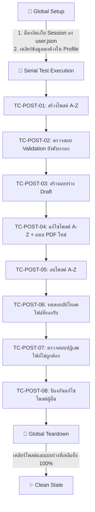

# 🎭 คู่มือและบันทึกการพัฒนาระบบทดสอบอัตโนมัติ (Playwright Automation Guide)

> **โปรเจกต์:** Testing-ShareED-Automate  
> **เป้าหมาย:** ชุดทดสอบอัตโนมัติระบบจัดการโพสต์สรุปความรู้ (Post Management - User Story 02)  
> **เทคโนโลยี:** Playwright Test (JavaScript), Node.js, Vercel Production Environment  

---

## 📑 สารบัญ (Table of Contents)
1. [ภาพรวมและสถาปัตยกรรมการทดสอบ (Architecture Overview)](#1-ภาพรวมและสถาปัตยกรรมการทดสอบ-architecture-overview)
2. [สรุปสิ่งที่เราได้พัฒนาและปรับปรุงทั้งหมด (What We Have Done)](#2-สรุปสิ่งที่เราได้พัฒนาและปรับปรุงทั้งหมด-what-we-have-done)
3. [รายละเอียด 8 Test Cases (Test Cases Breakdown)](#3-รายละเอียด-8-test-cases-test-cases-breakdown)
4. [โครงสร้างไดเรกทอรีและไฟล์สำคัญ (Project Structure)](#4-โครงสร้างไดเรกทอรีและไฟล์สำคัญ-project-structure)
5. [คู่มือคำสั่งที่ใช้งานบ่อย (Playwright Commands Cheatsheet)](#5-คู่มือคำสั่งที่ใช้งานบ่อย-playwright-commands-cheatsheet)
6. [เทคนิคและ Best Practices ที่ใช้ในโปรเจกต์](#6-เทคนิคและ-best-practices-ที่ใช้ในโปรเจกต์)

---

## 1. ภาพรวมและสถาปัตยกรรมการทดสอบ (Architecture Overview)

ระบบทดสอบชุดนี้ถูกออกแบบมาเพื่อทดสอบฟังก์ชันจัดการโพสต์อย่างสมบูรณ์แบบ (End-to-End Test) โดยมีแกนหลัก 3 ประการ:



### จุดเด่นของสถาปัตยกรรมนี้:
1. **Single Login via Storage State:** ล็อกอินเพียงครั้งเดียวใน `global-setup.js` แล้วบันทึก State ไว้ที่ `playwright/.auth/user.json` ทำให้ทุก Test Case ไม่ต้องเสียเวลาล็อกอินซ้ำ
2. **Sequential Flow (Serial Mode):** รันเคสเรียงลำดับ 1 ถึง 8 ต่อเนื่อง ทำให้สามารถสร้างโพสต์ใน TC-01 ➔ แก้ไขใน TC-04 ➔ ลบใน TC-05 ได้อย่างเป็นธรรมชาติ โดยไม่ต้องสร้างข้อมูลขยะซ้ำซ้อน
3. **Automated Teardown Cleanup:** เมื่อรันชุดทดสอบจบ ระบบจะเรียก `global-teardown.js` เพื่อเข้าไปลบทั้ง "แบบร่าง" และ "โพสต์" ที่ถูกสร้างขึ้นระหว่างรันทดสอบออกจนหมด คืนสภาพบัญชีให้สะอาด 100%

---

## 2. สรุปสิ่งที่เราได้พัฒนาและปรับปรุงทั้งหมด (What We Have Done)

| ลำดับ | สิ่งที่ได้ทำ | เหตุผลและผลลัพธ์ |
|---|---|---|
| 1 | **เปลี่ยนจาก TypeScript เป็น JavaScript (.js)** | ลดความซับซ้อนของ Build step รันได้เร็วและยืดหยุ่นขึ้นในสภาพแวดล้อมจริง |
| 2 | **รวมชุดทดสอบเป็นไฟล์เดียว (`01-create-post.spec.js`)** | แก้ปัญหาข้อมูลขัดแย้งกัน (Data race condition) และรันเรียงลำดับตาม User Journey จริง |
| 3 | **พัฒนาระบบ Auto-Cleanup (`cleanup.js`)** | วนลูปตรวจจับและลบแบบร่างและโพสต์ผ่าน UI อัตโนมัติ พร้อมตรวจจับ Async API cards |
| 4 | **ปรับแต่ง `TC-POST-04` (แก้ไขโพสต์ + แนบไฟล์ใหม่)** | รองรับการเปลี่ยนไฟล์ PDF (`แก้ไขโพสต์.pdf`) และรูปภาพประกอบ (`แก้ไข_ภาษาไทย.png`) อย่างถูกต้อง |
| 5 | **เพิ่ม `TC-POST-06` (Positive Upload Validation)** | ทดสอบการอัปโหลดไฟล์นามสกุลที่ถูกต้อง (.png, .jpeg, .pdf) ให้ระบบอนุญาตและแสดงผล |
| 6 | **เพิ่ม `.scrollIntoViewIfNeeded()` ทุกจุด** | เลื่อนหน้าจอลงไปมององค์ประกอบทุกตัวก่อนทำการ `expect(...).toBeVisible()` ป้องกัน Flaky Tests |
| 7 | **แก้ไข Strict Mode Violation ในการ Assert Modal** | แยกตรวจจับ `heading: ลบสำเร็จ!` และข้อความ `โพสต์ของคุณถูกลบเรียบร้อยแล้ว` ให้ผ่าน 100% |

---

## 3. รายละเอียด 8 Test Cases (Test Cases Breakdown)

### 📌 Scenario 2.1: ผู้ใช้งานสามารถสร้างและเผยแพร่โพสต์ใหม่
* **[Positive] TC-POST-01: สร้างโพสต์ด้วยข้อมูลที่ถูกต้องครบถ้วน**
  * **ขั้นตอน:** ล็อกอิน ➔ ไปหน้าสร้างโพสต์ ➔ กรอกชื่อเรื่อง, เลือกระดับชั้น, อัปโหลดรูปปก, กรอกบทสรุปย่อ, เลือกหมวดวิชาและแท็ก, กรอกเนื้อหา Rich Text, แนบไฟล์ PDF และรูปภาพประกอบ ➔ กด "โพสต์สรุปความรู้"
  * **การตรวจสอบ (Assertion):** แสดงแจ้งเตือน `โพสต์สำเร็จ!` และพบการ์ดโพสต์บนหน้า Home/Explore

* **[Negative] TC-POST-02: การสร้างโพสต์เมื่อข้อมูลช่องที่บังคับไม่ครบ**
  * **ขั้นตอน:** เข้าหน้าสร้างโพสต์ ➔ กดปุ่ม "โพสต์สรุปความรู้" โดยปล่อยว่างข้อมูลบังคับ
  * **การตรวจสอบ (Assertion):** แสดงข้อความ Inline Error ทั้ง 3 จุด:
    * `กรุณากรอกชื่อหัวข้อสรุปความรู้`
    * `กรุณาเลือกระดับชั้น`
    * `กรุณากรอกบทสรุปย่อ`

---

### 📌 Scenario 2.2: ผู้ใช้งานสามารถบันทึกโพสต์เป็นแบบร่าง
* **[Positive] TC-POST-03: การบันทึกโพสต์ฉบับร่างเมื่อข้อมูลช่องที่บังคับครบถ้วน**
  * **ขั้นตอน:** กรอกข้อมูลโพสต์ ➔ กดปุ่ม "บันทึกแบบร่าง" ➔ กด "OK" บนแจ้งเตือน
  * **การตรวจสอบ (Assertion):** ไปที่หน้า Profile ➔ เลือกแท็บ "แบบร่าง" ➔ พบการ์ดแบบร่างที่บันทึกไว้

---

### 📌 Scenario 2.3: ผู้ใช้งานสามารถแก้ไขโพสต์ของตนเอง
* **[Positive] TC-POST-04: ผู้ใช้งานสามารถแก้ไขโพสต์ของตนเอง**
  * **ขั้นตอน:** เข้าหน้า Profile ➔ คลิกโพสต์ที่สร้างจาก TC-01 ➔ กด "แก้ไขโพสต์" ➔ อัปเดตคำอธิบายย่อ, เนื้อหาละเอียด, ลบไฟล์ PDF เดิมและแนบ `แก้ไขโพสต์.pdf`, แนบรูปภาพ `แก้ไข_ภาษาไทย.png` ➔ กด "บันทึกและโพสต์"
  * **การตรวจสอบ (Assertion):** 
    * กล่องอัปโหลดแสดงชื่อ `แก้ไขโพสต์.pdf`
    * แสดงแจ้งเตือน `บันทึกการแก้ไขสำเร็จ!`
    * หน้ารายละเอียดแสดงชื่อเรื่อง, บทสรุปย่อ และเนื้อหาที่อัปเดตใหม่ตรงตามที่แก้

---

### 📌 Scenario 2.4: ผู้ใช้งานสามารถลบโพสต์ของตนเองได้สำเร็จ
* **[Positive] TC-POST-05: ผู้ใช้งานสามารถลบโพสต์ของตนเองได้สำเร็จ**
  * **ขั้นตอน:** เข้าหน้า Profile ➔ คลิกโพสต์จาก TC-04 ➔ กดปุ่ม "ลบโพสต์" ➔ กดยืนยัน "ใช่, ลบเลย" ➔ กดปุ่ม "OK"
  * **การตรวจสอบ (Assertion):**
    * แสดง Modal หัวข้อ `ลบสำเร็จ!` และข้อความ `โพสต์ของคุณถูกลบเรียบร้อยแล้ว`
    * ชื่อโพสต์ดังกล่าวถูกถอนออกจากระบบและมองไม่เห็นอีกต่อไป (`toBeHidden()`)

---

### 📌 Scenario 2.5: ตรวจสอบประเภทไฟล์ที่ระบบรองรับและไม่รองรับ
* **[Positive] TC-POST-06: อัพโหลด ไฟล์ประเภทที่ ระบบรองรับ (PNG, JPEG, PDF)**
  * **ขั้นตอน:** เข้าหน้าสร้างโพสต์ ➔ แนบรูปปก (.png) ➔ แนบเอกสาร (.pdf) ➔ แนบรูปภาพประกอบ (.png)
  * **การตรวจสอบ (Assertion):** ชื่อไฟล์เอกสารแสดงขึ้นมา และไม่มีข้อความแจ้งเตือน Error เรื่องประเภทไฟล์

* **[Negative] TC-POST-07: อัพโหลด ไฟล์ประเภทที่ ระบบไม่รองรับ (.DOCX หรือ .GIF)**
  * **ขั้นตอน:** พยายามแนบไฟล์ `.gif` ที่รูปปก, แนบไฟล์ `.docx` ที่ช่อง PDF, แนบไฟล์ `.gif` ที่รูปภาพประกอบ
  * **การตรวจสอบ (Assertion):** แสดงแจ้งเตือนปฏิเสธไฟล์:
    * `สามารถอัปโหลดไฟล์ .jpg,.jpeg,.png เท่านั้น` (ที่ช่องรูปปกและรูปภาพ)
    * `สามารถอัปโหลดไฟล์ .pdf เท่านั้น` (ที่ช่องเอกสาร PDF)

---

### 📌 Scenario 2.6: ระบบไม่อนุญาตให้แก้ไขหรือลบโพสต์ของบุคคลอื่น
* **[Negative] TC-POST-08: ระบบไม่อนุญาตให้แก้ไขหรือลบโพสต์ของบุคคลอื่น**
  * **ขั้นตอน:** เข้าไปยังหน้ารายละเอียดโพสต์ของ Member B ➔ ตรวจสอบปุ่มแก้ไข/ลบ ➔ พยายามเข้าผ่าน URL แก้ไขโดยตรง (`/post/edit/:otherUserPostId`) ➔ กดบันทึก
  * **การตรวจสอบ (Assertion):**
    * ที่หน้ารายละเอียดโพสต์ของผู้อื่น ไม่มีปุ่ม "แก้ไขโพสต์" และ "ลบโพสต์" แสดงขึ้นมา
    * เมื่อพยายามยิง URL แก้ไข ระบบแสดงแจ้งเตือน `คุณไม่มีสิทธิ์แก้ไขโพสต์ของผู้อื่น`

---

## 4. โครงสร้างไดเรกทอรีและไฟล์สำคัญ (Project Structure)

```text
Testing-ShareED-Automate/
├── global-setup.js               # สคริปต์เตรียม Session ล็อกอินและบันทึกลง user.json
├── global-teardown.js            # สคริปต์ทำความสะอาดลบข้อมูลทั้งหมดหลังรันเสร็จ
├── playwright.config.js          # ไฟล์การตั้งค่า Playwright (Timeout, BaseURL, StorageState)
├── playwright.md                 # เอกสารสรุปและคู่มือชุดทดสอบ (ไฟล์นี้)
│
├── test-data/                    # แหล่งรวมไฟล์ที่ใช้ทดสอบ
│   ├── files/
│   │   ├── สรุปข้อมูล.pdf         # ไฟล์ PDF สำหรับสร้างโพสต์เริ่มต้น
│   │   ├── แก้ไขโพสต์.pdf        # ไฟล์ PDF สำหรับทดสอบการแก้ไขโพสต์
│   │   └── sample-invalid.docx   # ไฟล์ประเภทที่ไม่รองรับ
│   └── images/
│       ├── Gemini-cover-engAZ.png # รูปภาพปก
│       ├── คำนาม.png              # รูปภาพประกอบ 1
│       ├── สระ.png                # รูปภาพประกอบ 2
│       ├── แก้ไข_ภาษาไทย.png      # รูปภาพสำหรับทดสอบแก้ไขโพสต์
│       └── sample-invalid.gif    # รูปภาพประเภทที่ไม่รองรับ
│
├── tests/
│   ├── posts/
│   │   └── 01-create-post.spec.js # ชุดทดสอบรวม 8 Test Cases (Serial Execution)
│   └── utils/
│       └── cleanup.js             # ฟังก์ชันลบโพสต์และแบบร่างอัตโนมัติ
│
└── playwright/
    └── .auth/
        └── user.json              # Session State ที่บันทึกไว้จากการล็อกอิน
```

---

## 5. คู่มือคำสั่งที่ใช้งานบ่อย (Playwright Commands Cheatsheet)

### 🖥️ คำสั่งรันผ่าน Terminal (CLI Commands)

```powershell
# 1. รันทดสอบแบบเปิดหน้าต่าง Browser ให้เห็นสดๆ (Headed Mode)
npx.cmd playwright test tests/posts/01-create-post.spec.js --headed

# 2. รันทดสอบแบบเบื้องหลังความเร็วสูง (Headless Mode)
npx.cmd playwright test tests/posts/01-create-post.spec.js

# 3. รันเฉพาะ Test Case ที่ระบุ (เช่น รันเฉพาะ TC-POST-04)
npx.cmd playwright test -g "TC-POST-04" --headed

# 4. เปิด UI Mode สำหรับ Debug แบบ Interactive
npx.cmd playwright test --ui

# 5. เปิดดูรายงานผลการทดสอบแบบ HTML สวยงาม
npx.cmd playwright show-report

# 6. เปิดเครื่องมือบันทึกสคริปต์อัตโนมัติ (CodeGen)
npx.cmd playwright codegen https://share-ed-frontend-gamma.vercel.app/
```

---

## 6. เทคนิคและ Best Practices ที่ใช้ในโปรเจกต์

### 1. การเลื่อนหน้าจอลงไปมององค์ประกอบ (`scrollIntoViewIfNeeded`)
ช่วยแก้ปัญหาองค์ประกอบที่อยู่ด้านล่างของหน้าจอ หรืออยู่นอก Viewport:
```javascript
// เลื่อนหน้าจอลงไปให้เห็นองค์ประกอบก่อนกดหรือตรวจสอบ
await page.getByText('ข้อความที่ต้องการ').scrollIntoViewIfNeeded();
await expect(page.getByText('ข้อความที่ต้องการ')).toBeVisible({ timeout: 15000 });
```

### 2. การระบุ Locator ตามมาตรฐาน Accessibility (Role-based)
แนะนำให้ใช้คำสั่งกลุ่ม `getByRole` เพื่อความทนทานต่อการเปลี่ยนโค้ด HTML:
```javascript
// ปุ่มทั่วไป
await page.getByRole('button', { name: 'บันทึกและโพสต์' }).click();

// ช่องกรอกข้อความ
await page.getByRole('textbox', { name: 'อีเมล' }).fill('user@gmail.com');

// Dropdown (Combobox)
await page.getByRole('combobox').selectOption('มัธยมศึกษาตอนต้น');

// Dialog หรือ Modal แจ้งเตือน
await expect(page.getByRole('dialog', { name: /โพสต์สำเร็จ/i })).toBeVisible();
```

### 3. การอัปโหลดไฟล์
```javascript
// อัปโหลดไฟล์เดี่ยว
await page.getByLabel('อัปโหลดไฟล์ PDF').setInputFiles('path/to/file.pdf');

// อัปโหลดหลายไฟล์พร้อมกัน
await page.getByLabel('', { exact: true }).setInputFiles([
  'path/to/image1.png',
  'path/to/image2.png'
]);
```

---
*เอกสารนี้ถูกปรับปรุงล่าสุดเพื่อให้สอดคล้องกับชุดทดสอบ Post Management Version 1.1.0 สมบูรณ์แบบ 100%*
