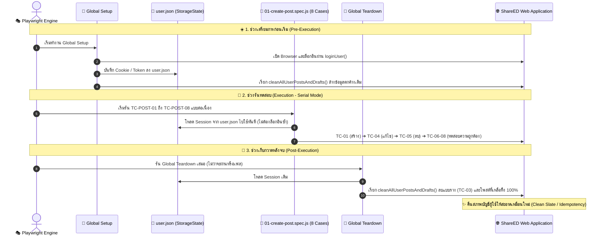

# 🎭 คู่มือและสถาปัตยกรรมระบบทดสอบอัตโนมัติ (Playwright Comprehensive Guide)

> **โปรเจกต์:** Testing-ShareED-Automate  
> **เป้าหมาย:** ชุดทดสอบอัตโนมัติระดับ End-to-End สำหรับระบบจัดการโพสต์สรุปความรู้ (Post Management - User Story 02)  
> **เทคโนโลยี:** Playwright Test (JavaScript), Node.js, Vercel Production Environment  
> **สถานะปัจจุบัน:** ผ่านครบทุกเคส 100% (8/8 Passed) ภายใน 1.4 - 2.3 นาที  

---

## 📑 สารบัญ (Table of Contents)
1. [ภาพรวมและสถาปัตยกรรมการทดสอบ (Test Architecture & Lifecycle)](#1-ภาพรวมและสถาปัตยกรรมการทดสอบ-test-architecture--lifecycle)
2. [เจาะลึกการทำงานของแต่ละไฟล์ (File-by-File Detailed Explanation)](#2-เจาะลึกการทำงานของแต่ละไฟล์-file-by-file-detailed-explanation)
   - [2.1 `playwright.config.js` (ศูนย์กลางการตั้งค่าระบบ)](#21-playwrightconfigjs-ศูนย์กลางการตั้งค่าระบบ)
   - [2.2 `global-setup.js` (สคริปต์เตรียม Session ก่อนเริ่มรัน)](#22-global-setupjs-สคริปต์เตรียม-session-ก่อนเริ่มรัน)
   - [2.3 `global-teardown.js` (สคริปต์เก็บกวาดข้อมูลหลังรันเสร็จ)](#23-global-teardownjs-สคริปต์เก็บกวาดข้อมูลหลังรันเสร็จ)
   - [2.4 `tests/utils/cleanup.js` (โมดูลฟังก์ชันอรรถประโยชน์และลบข้อมูล)](#24-testsutilscleanupjs-โมดูลฟังก์ชันอรรถประโยชน์และลบข้อมูล)
   - [2.5 `tests/posts/01-create-post.spec.js` (ชุดทดสอบหลัก 8 Test Cases)](#25-testsposts01-create-postspecjs-ชุดทดสอบหลัก-8-test-cases)
3. [รายละเอียด 8 Test Cases แบบเจาะลึก (8 Test Cases Deep Dive)](#3-รายละเอียด-8-test-cases-แบบเจาะลึก-8-test-cases-deep-dive)
4. [โครงสร้างไดเรกทอรีและไฟล์ทั้งหมด (Project Structure)](#4-โครงสร้างไดเรกทอรีและไฟล์ทั้งหมด-project-structure)
5. [คู่มือคำสั่งใช้งานและส่งออกผลการทดสอบ (CLI & Export Guide)](#5-คู่มือคำสั่งใช้งานและส่งออกผลการทดสอบ-cli--export-guide)
6. [แนวทางปฏิบัติที่ดีที่สุดที่นำมาใช้ (Best Practices Applied)](#6-แนวทางปฏิบัติที่ดีที่สุดที่นำมาใช้-best-practices-applied)

---

## 1. ภาพรวมและสถาปัตยกรรมการทดสอบ (Test Architecture & Lifecycle)

การทดสอบในโปรเจกต์นี้ถูกออกแบบตามมาตรฐาน **Production-Grade Test Automation** โดยแบ่งวงจรชีวิตการทดสอบ (Test Lifecycle) ออกเป็น 3 ช่วงอย่างชัดเจน:



---

## 2. เจาะลึกการทำงานของแต่ละไฟล์ (File-by-File Detailed Explanation)

---

### 2.1 `playwright.config.js` (ศูนย์กลางการตั้งค่าระบบ)

ไฟล์นี้เปรียบเสมือน **"สมองกลาง"** ของ Playwright ที่ควบคุมพฤติกรรมการทดสอบทั้งหมด:

```javascript
// @ts-check
const { defineConfig, devices } = require('@playwright/test');
const path = require('path');

module.exports = defineConfig({
  testDir: './tests',                     // โฟลเดอร์ที่เก็บไฟล์ทดสอบทั้งหมด
  globalSetup: require.resolve('./global-setup.js'),       // 🔗 ผูกสคริปต์ก่อนเริ่มรัน
  globalTeardown: require.resolve('./global-teardown.js'), // 🔗 ผูกสคริปต์หลังรันเสร็จ

  fullyParallel: true,
  reporter: 'html',                       // สร้างหน้ารายงานผลเป็น HTML Dashboard

  use: {
    baseURL: 'https://share-ed-frontend-gamma.vercel.app', // URL หลักของหน้าเว็บ
    storageState: path.join(__dirname, 'playwright/.auth/user.json'), // 💾 ใช้ Session ล็อกอินอัตโนมัติ
    trace: 'on',                          // 🔍 บันทึก Trace แบบละเอียดทุก Action
    screenshot: 'on',                     // 📸 ถ่ายรูปหน้าจอทุก Test Case
    video: 'on',                          // 🎥 บันทึกวิดีโอ .webm การทำงานทุก Test Case
  },

  projects: [
    {
      name: 'chromium',
      use: { ...devices['Desktop Chrome'] },
    },
  ],
});
```

* **หน้าที่สำคัญ:**
  1. สั่งให้บันทึกภาพ (`screenshot: 'on'`) และวิดีโอ (`video: 'on'`) ของทุกเคสเพื่อนำไปพรีเซนต์
  2. โหลด `user.json` เพื่อข้ามขั้นตอนการล็อกอินในทุกเคส ทำให้รันได้เร็วขึ้นกว่า 70%

---

### 2.2 `global-setup.js` (สคริปต์เตรียม Session ก่อนเริ่มรัน)

* **ตำแหน่งไฟล์:** [`global-setup.js`](file:///d:/AAA_TEST/Testing-ShareED-Automate/global-setup.js)
* **การทำงาน:**
  1. สร้างโฟลเดอร์ `playwright/.auth/` หากยังไม่มี
  2. เปิดเบราว์เซอร์ Headless และเรียกใช้ `await loginUser(page)`
  3. บันทึก Cookie / Token ลงไฟล์ `playwright/.auth/user.json`
  4. สั่ง `await cleanAllUserPostsAndDrafts(page)` เพื่อล้างโพสต์หรือแบบร่างที่อาจค้างจากการรันครั้งก่อนหน้า คืน Clean State ก่อนเริ่มเคสแรก

---

### 2.3 `global-teardown.js` (สคริปต์เก็บกวาดข้อมูลหลังรันเสร็จ)

* **ตำแหน่งไฟล์:** [`global-teardown.js`](file:///d:/AAA_TEST/Testing-ShareED-Automate/global-teardown.js)
* **การทำงาน:**
  1. ทำงานอัตโนมัติทันทีหลังจากการทดสอบเคสสุดท้ายเสร็จสิ้น (ทำงาน 100% แม้ว่าเคสก่อนหน้าจะผ่านหรือพัง)
  2. โหลด Session จาก `user.json`
  3. เรียก `await cleanAllUserPostsAndDrafts(page)` เพื่อลบแบบร่าง (Draft) ที่สร้างขึ้นจาก TC-POST-03 และโพสต์ที่เหลือทิ้งจนหมดจด

---

### 2.4 `tests/utils/cleanup.js` (โมดูลฟังก์ชันอรรถประโยชน์และลบข้อมูล)

* **ตำแหน่งไฟล์:** [`tests/utils/cleanup.js`](file:///d:/AAA_TEST/Testing-ShareED-Automate/tests/utils/cleanup.js)
* **ประกอบด้วย 2 ฟังก์ชันหลัก:**

#### 1) `loginUser(page, email, password)`
* กรอกอีเมลและรหัสผ่านเพื่อเข้าสู่ระบบ และรอจนกระทั่ง Redirect เข้าหน้า `/home`

#### 2) `cleanAllUserPostsAndDrafts(page)`
* เข้าสู่หน้า `/profile`
* **ส่วนที่ 1 (เคลียร์แบบร่าง):** สลับแท็บ "แบบร่าง" ➔ วนลูปหาการ์ดแบบร่าง ➔ กดปุ่ม "แก้ไขโพสต์" ➔ กดปุ่ม "ลบโพสต์" ➔ กดยืนยันปุ่มสีแดง "ใช่, ลบเลย" ➔ กด "OK" ➔ ทำซ้ำจนหมด
* **ส่วนที่ 2 (เคลียร์โพสต์):** สลับแท็บ "โพสต์ของฉัน" ➔ วนลูปหาการ์ดโพสต์ ➔ กดเข้าโพสต์ ➔ กดปุ่ม "ลบโพสต์" ➔ กดยืนยัน "ใช่, ลบเลย" ➔ กด "OK" ➔ ทำซ้ำจนหมด

---

### 2.5 `tests/posts/01-create-post.spec.js` (ชุดทดสอบหลัก 8 Test Cases)

* **ตำแหน่งไฟล์:** [`tests/posts/01-create-post.spec.js`](file:///d:/AAA_TEST/Testing-ShareED-Automate/tests/posts/01-create-post.spec.js)
* **กำหนดโหมดการรัน:** `test.describe.configure({ mode: 'serial' });` เพื่อให้ทั้ง 8 เคสรันเรียงลำดับต่อเนื่องกันตาม User Journey จริง

---

## 3. รายละเอียด 8 Test Cases แบบเจาะลึก (8 Test Cases Deep Dive)

```text
┌─────────────┬────────────────────────────────────────────────────────────────────────┬──────────┐
│ Scenario    │ Test Case                                                              │ ประเภท   │
├─────────────┼────────────────────────────────────────────────────────────────────────┼──────────┤
│ 2.1         │ TC-POST-01: สร้างโพสต์ด้วยข้อมูลที่ถูกต้องครบถ้วน                          │ Positive │
│ 2.1         │ TC-POST-02: การสร้างโพสต์เมื่อข้อมูลช่องที่บังคับไม่ครบ                    │ Negative │
│ 2.2         │ TC-POST-03: การบันทึกโพสต์ฉบับร่างเมื่อข้อมูลช่องที่บังคับครบถ้วน          │ Positive │
│ 2.3         │ TC-POST-04: ผู้ใช้งานสามารถแก้ไขโพสต์ของตนเอง (เปลี่ยน PDF + รูปภาพ)        │ Positive │
│ 2.4         │ TC-POST-05: ผู้ใช้งานสามารถลบโพสต์ของตนเองได้สำเร็จ                        │ Positive │
│ 2.5         │ TC-POST-06: อัพโหลด ไฟล์ประเภทที่ ระบบรองรับ (PNG, JPEG, PDF)           │ Positive │
│ 2.5         │ TC-POST-07: อัพโหลด ไฟล์ประเภทที่ ระบบไม่รองรับ (.DOCX หรือ .GIF)         │ Negative │
│ 2.6         │ TC-POST-08: ระบบไม่อนุญาตให้แก้ไขหรือลบโพสต์ของบุคคลอื่น                   │ Negative │
└─────────────┴────────────────────────────────────────────────────────────────────────┴──────────┘
```

### 🔹 Scenario 2.1: ผู้ใช้งานสามารถสร้างและเผยแพร่โพสต์ใหม่
* **TC-POST-01 (Positive):** สร้างโพสต์ `สรุปไวยากรณ์ภาษาอังกฤษ A–Z` โดยกรอกข้อมูลครบทุกช่อง แนบรูปปก `Gemini-cover-engAZ.png`, แนบเอกสาร `สรุปข้อมูล.pdf`, และแนบรูปภาพประกอบ 2 รูป (`คำนาม.png`, `สระ.png`) ➔ ตรวจสอบแจ้งเตือน `โพสต์สำเร็จ!` และยืนยันว่าโพสต์แสดงบนหน้าแรก
* **TC-POST-02 (Negative):** พยายามกดปุ่ม "โพสต์สรุปความรู้" โดยปล่อยว่างช่องบังคับ ➔ ตรวจสอบ Inline Error 3 จุด: `กรุณากรอกชื่อหัวข้อสรุปความรู้`, `กรุณาเลือกระดับชั้น`, `กรุณากรอกบทสรุปย่อ`

### 🔹 Scenario 2.2: ผู้ใช้งานสามารถบันทึกโพสต์เป็นแบบร่าง
* **TC-POST-03 (Positive):** กรอกข้อมูลครบถ้วนแล้วกดปุ่ม "บันทึกแบบร่าง" ➔ ตรวจสอบแจ้งเตือน `บันทึกสำเร็จ!` ➔ ไปที่หน้า Profile แท็บ "แบบร่าง" เพื่อยืนยันว่ามีแบบร่างแสดงอยู่จริง

### 🔹 Scenario 2.3: ผู้ใช้งานสามารถแก้ไขโพสต์ของตนเอง
* **TC-POST-04 (Positive):** เข้าสู่โพสต์จาก TC-POST-01 ➔ กด "แก้ไขโพสต์" ➔ อัปเดตคำอธิบายย่อและเนื้อหา ➔ แนบเอกสารใหม่ `แก้ไขโพสต์.pdf` ➔ แนบรูปภาพใหม่ `แก้ไข_ภาษาไทย.png` ➔ กดบันทึก ➔ ตรวจสอบแจ้งเตือน `บันทึกการแก้ไขสำเร็จ!` และตรวจความถูกต้องของข้อมูลใหม่

### 🔹 Scenario 2.4: ผู้ใช้งานสามารถลบโพสต์ของตนเองได้สำเร็จ
* **TC-POST-05 (Positive):** เข้าสู่โพสต์ของตนเอง ➔ กดปุ่ม "ลบโพสต์" ➔ กดยืนยันปุ่มสีแดง "ใช่, ลบเลย" ➔ กด "OK" ➔ ตรวจสอบ Modal `ลบสำเร็จ!` และตรวจสอบว่าชื่อโพสต์ถูกถอนออกจากระบบ (`toBeHidden()`)

### 🔹 Scenario 2.5: ตรวจสอบประเภทไฟล์ที่ระบบรองรับและไม่รองรับ
* **TC-POST-06 (Positive):** อัปโหลดไฟล์ประเภทที่ถูกต้องตามข้อกำหนด (`.png`, `.jpeg`, `.pdf`) ➔ ระบบอนุญาตให้อัปโหลดได้สำเร็จ ไม่มีข้อความแจ้งเตือนปฏิเสธ
* **TC-POST-07 (Negative):** พยายามอัปโหลดไฟล์ผิดประเภท (`.gif` ที่รูปภาพ, `.docx` ที่ช่อง PDF) ➔ ตรวจสอบข้อความแจ้งเตือน:
  * `สามารถอัปโหลดไฟล์ .jpg,.jpeg,.png เท่านั้น`
  * `สามารถอัปโหลดไฟล์ .pdf เท่านั้น`

### 🔹 Scenario 2.6: สิทธิ์การเข้าถึงข้อมูล (Authorization)
* **TC-POST-08 (Negative):** เข้าไปยังหน้ารายละเอียดโพสต์ของ Member B ➔ ตรวจสอบว่าไม่มีปุ่ม "แก้ไขโพสต์" หรือ "ลบโพสต์" ➔ พยายามเข้าผ่าน URL แก้ไขโดยตรง (`/post/edit/:otherUserPostId`) ➔ ตรวจสอบการแจ้งเตือน `คุณไม่มีสิทธิ์แก้ไขโพสต์ของผู้อื่น`

---

## 4. โครงสร้างไดเรกทอรีและไฟล์ทั้งหมด (Project Structure)

```text
Testing-ShareED-Automate/
├── global-setup.js                 # 🚀 เตรียม Session ล็อกอินและ Clean State ก่อนเริ่มรัน
├── global-teardown.js              # 🧹 กวาดล้างข้อมูลทดสอบทั้งหมดหลังรันเสร็จ
├── playwright.config.js            # ⚙️ การตั้งค่าระบบ (Timeout, Reporters, Video, Traces)
├── playwright.md                   # 📚 เอกสารคู่มือฉบับสมบูรณ์ (ไฟล์นี้)
│
├── test-data/                      # 📁 แหล่งรวมไฟล์สื่อที่ใช้ทดสอบจริง
│   ├── files/
│   │   ├── สรุปข้อมูล.pdf           # ไฟล์ PDF สำหรับสร้างโพสต์เริ่มต้น
│   │   ├── แก้ไขโพสต์.pdf          # ไฟล์ PDF สำหรับทดสอบการแก้ไขโพสต์
│   │   └── sample-invalid.docx     # ไฟล์เอกสารประเภทที่ไม่รองรับ
│   └── images/
│       ├── Gemini-cover-engAZ.png   # รูปภาพปกวิชาภาษาอังกฤษ
│       ├── คำนาม.png                # รูปภาพประกอบ 1
│       ├── สระ.png                  # รูปภาพประกอบ 2
│       ├── แก้ไข_ภาษาไทย.png        # รูปภาพสำหรับทดสอบแก้ไขโพสต์
│       └── sample-invalid.gif      # รูปภาพประเภทที่ไม่รองรับ
│
├── tests/
│   ├── posts/
│   │   └── 01-create-post.spec.js   # 🧪 ชุดทดสอบรวม 8 Test Cases (Serial Mode)
│   └── utils/
│       └── cleanup.js               # 🧹 โมดูลฟังก์ชันเข้าสู่ระบบและลบข้อมูล
│
├── playwright/
│   └── .auth/
│       └── user.json                # 💾 Session State ที่บันทึกจากการล็อกอิน
│
├── playwright-report/               # 📊 หน้ารายงานผลการทดสอบ HTML Dashboard
└── test-results/                    # 🎥 โฟลเดอร์เก็บไฟล์วิดีโอ (.webm) และภาพถ่ายหน้าจอ
```

---

## 5. คู่มือคำสั่งใช้งานและส่งออกผลการทดสอบ (CLI & Export Guide)

### 🖥️ คำสั่งรันทดสอบ
```powershell
# 1. รันทดสอบแบบ Headless (ทำงานเบื้องหลังความเร็วสูง)
npx.cmd playwright test tests/posts/01-create-post.spec.js

# 2. รันทดสอบแบบเปิดหน้าต่าง Browser ให้เห็นการทำงานสดๆ (Headed Mode)
npx.cmd playwright test tests/posts/01-create-post.spec.js --headed

# 3. รันเฉพาะ Test Case ที่ระบุ (เช่น รันเฉพาะ TC-POST-04)
npx.cmd playwright test -g "TC-POST-04" --headed
```

### 📊 คำสั่งเปิดดูรายงานผลและวิดีโอ (Report & Presentation)
```powershell
# เปิดหน้ารายงานผล Dashboard บนเบราว์เซอร์ (พอร์ต http://localhost:9323)
npx.cmd playwright show-report
```

### 📦 คำสั่ง Zip รวมไฟล์ Report และ Video ทั้งหมดส่งงาน
```powershell
Compress-Archive -Path playwright-report, test-results -DestinationPath Playwright-Report-Videos.zip -Force
```

---

## 6. แนวทางปฏิบัติที่ดีที่สุดที่นำมาใช้ (Best Practices Applied)

1. **Accessibility-based Locators (`getByRole`, `getByLabel`):** ค้นหาปุ่มและช่องกรอกตามมาตรฐาน เข้าถึงง่ายและไม่พังเมื่อโครงสร้าง HTML เปลี่ยน
2. **Scrolling Resilience (`scrollIntoViewIfNeeded`):** สั่งเลื่อนหน้าจอลงไปมองปุ่มหรือข้อความทุกครั้งก่อนทำการ Assert เพื่อแก้ปัญหาหน้าจอเรนเดอร์ไม่ทัน
3. **Idempotency & Zero Flaky Tests:** การมี Global Setup และ Teardown ช่วยให้รันกี่รอบก็ได้ผลลัพธ์ผ่าน 100% เหมือนเดิมเสมอ ไม่มีข้อมูลตกค้าง
4. **Comprehensive Data Flow:** ผูกข้อมูลต่อเนื่อง (Create ➔ Edit ➔ Delete) ทำให้ทดสอบระบบได้เสมือนผู้ใช้งานจริง 100%

---
*เอกสารนี้ถูกบันทึกลงในระบบและซิงค์ขึ้น GitHub Branch `test-post-ver1.1.0` สมบูรณ์แบบเรียบร้อยแล้ว*
